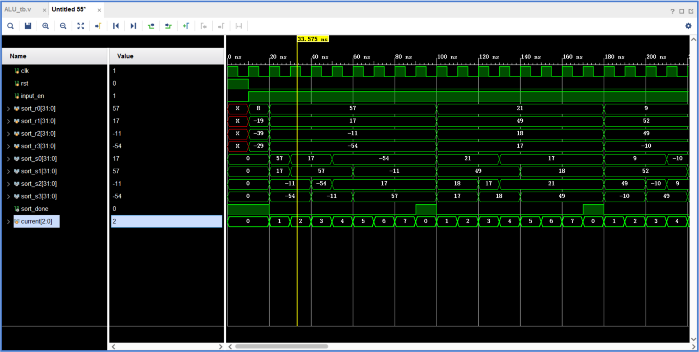
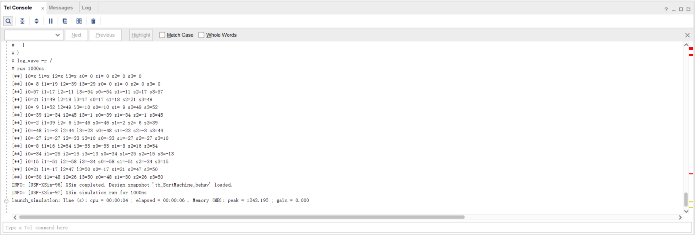

# 实验一 运算器与排序

[TOC]

## 1 实验目标

1.  掌握算术逻辑单元（ALU）的功能，加/减运算时溢出、进位/借位、零标志的形成及其应用；
  
2.  掌握数据通路和控制器的设计和描述方法。

## 2 实验内容

### 2.1 ALU的设计


待设计的ALU模块的逻辑符号如图-1所示。该模块的功能是将两操作数（a，b）按照指定的操作方式（m）进行运算，产生运算结果（y）和相应的标志（f）。


<center>图-1 ALU模块逻辑符号
</center>
操作方式 `m` 的编码与 ALU 的功能对应关系如`表-1`所示。表中标志`f` 细化为进位/借位标志`cf`、溢出标志`of`和零标志`zf`；`*`表示根据运算结果设置相应值；`x`表示无关项，可取任意值。例如，加法运算后设置进位标志`cf`、`of`和`zf`，减法运算后设置借位标志`cf`、`of`和`zf`。


<center>表-1 ALU模块功能表</center>

参数化的ALU模块端口声明如下：

```verilog
module alu 
#(parameter WIDTH = 32) 		//数据宽度
(
    output [WIDTH-1:0] y, 	//运算结果
    output zf, 					//零标志
    output cf, 					//进位/借位标志
    output of, 					//溢出标志
    input [WIDTH-1] a, b, 	//两操作数
    input m 					//操作类型
);
......
endmodule
```

### 2.2 排序电路的设计


利用前面设计的ALU模块，辅之以若干寄存器和数据选择器，以及适当的控制器，设计实现四个4位有符号数的排序电路，其逻辑符号如图-2所示。


<center>图-2 排序电路逻辑符号
</center>
该排序电路模块端口声明如下：

```verilog
module sort
#(parameter N = 4) //数据宽度
(
    output [N-1:0] s0, s1, s2, s3, //排序后的四个数据（递增）
	output done, //排序结束标志
    input [N-1:0] x0, x1, x2, x3, //原始输入数据
	input clk, rst //时钟（上升沿有效）、复位（高电平有效）
);
......
endmodule
```

示例：三个无符号数排序电路的数据通路、控制器及其状态图如图-3和图-4所示。


<center>图-3 三个无符号数排序电路的数据通路逻辑框图
</center>


<center></center>

<center>图-4 三个无符号数排序电路的控制器及其状态图
</center>
## 3 实验步骤

### 3.1  ALU模块的编写及功能仿真

#### 3.1.1 ALU 模块的编写

rep[ALU_MOD]

rep[ALU_always]

#### 3.1.2 ALU模块的仿真

rep[tb_ALU]

rep[tb_ALU2]

### 3.2  设计排序电路，并进行功能仿真

#### 3.2.1 排序电路的设计

##### 排序算法

本实验所采用的排序算法是为并行工作设计的（具体方法类似思考题2）。排序的方法（并行）如下图所示：


这里 SWAP 是指，如果两个数据（比如图中的a0、b0），满足 a0 < b0，就把他们交换（SWAP）否则就保持不变。这样 a1 就一定是两个数中较大的那个，b1就一定是两个数中较小的那个。

这里的a0、b0、c0、d0经过图中所示的操作（这里为了简单，假设这四个数都不相同），就能得到满足 a3 > b3 > c3 >d3 的  a3、b3、c3、d3。下面给出证明：

**证明：**在第一次变换之后，我们得到 `a1 = max(a0,b0)` `c1 = max(c0,d0)` 。第二次变换的a2满足 `a2 = max(a1,c1) = max(a0,b0,c0,d0)` 为四个数中的最大值，同理 d2 为最初四个数的最小值。

利用上面的这种特性，我们自然得到 `a2 > b2,c2 > d2` 这样下来就只剩下 `b2,c2` 的顺序没有确定了，在最后一次的 **SWAP** 后，就可以明确的确定出来四个数的大小顺序 `a2 > max(b2,c2)[即b3] > min(b2,c3)[即c3] > d2`。 **证毕。**

这种算法有以下优势：

1. 可并行：三次变换中有两个SWAP可以同时进行，可以比较容易地实现并行。
2. 比较次数少：整个过程中采用5次比较，而4个数做排序最少需要比较 $\lg(4!)= \lg(24)$  次，而由 $2^4 < 24 < 2^5$ 可知，5次比较在四个数的情况下达到最优。（比较次数少对串行实现以为着时间短，对并行实现意味着需要的器件数少）
3. 易扩展：如果要实现 $2^n$ 个数做比较，可以直接递归实现（比如实现8个数做比较，将上图中的 SWAP换成 4个数做排序，然后在 a0、b0、c0、d0 处每个可以放两个数，就可以实现8个数的排序，证明可以类比上面的证明）。对$2^n$ 个数进行排序仅仅需要比较 $5^{n-1}$ 次，故可以算得比较次数意义上的复杂度为$O(N^{\lg_2(5)})$ （我承认这个与$O(n\lg(n))$ 还有一定差距，不过可以想象，这个算法应该还有优化的空间）。

##### 单ALU串行实现

将每一步运算分到每个周期上，不同的周期完成不同的计算任务即可。


#### 3.2.2 排序电路的数据通路

rep[datapath]

#### 3.2.3 控制电路的编写

rep[Ctrl]

#### 3.2.4 排序电路的仿真

rep[tb_SortMachine]

波形和文本的输出：





### 3.3  排序电路下载至FPGA中测试

>  4个输入数据x0 \~ x3顺序对应SW0 ~ SW15，排序后数据s0 \~ s3顺序对应LED0 \~ LED15，done对应三色LED的绿色灯，clk对应BTNC，rst对应BTNL。


## 5 思考题

### 5.1  如果要求排序后的数据是递减顺序，电路如何调整？

这个功能已经在代码中实现了，代码如下（上面已经提到了）

```verilog
	// 给出寄存器mux的输出
	always @(*) begin
        {s0_mux, s1_mux, s2_mux, s3_mux} = 0;
        {s0_wr_en, s1_wr_en, s2_wr_en, s3_wr_en} = 0;
        // ORDER_ASCEND 选择在 alu_cf 为 1 还是为 0 时进行交换
        if (alu_cf == ORDER_DESCEND) begin
            case(current)
                .......
            endcase
        end
    end
```

显然当要递减排序的时候，应当在出现进位（意味着第一个数大于等于第二个数）的时候进行交换，递增排序则相反。

### 5.2  如果为了提高性能，使用两个ALU，电路如何调整？

下面介绍上述排序算法的并行实现：

##### 多ALU并行实现


将相同的任务分配到相同的时钟周期即可。

##### 流水线实现

将SWAP换成完全的组合电路，然后将将所有中间结果作为段寄存器就得到流水线实现。


