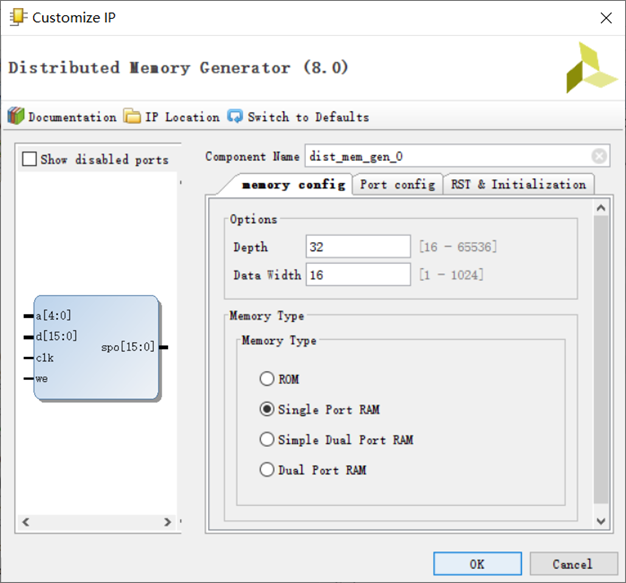
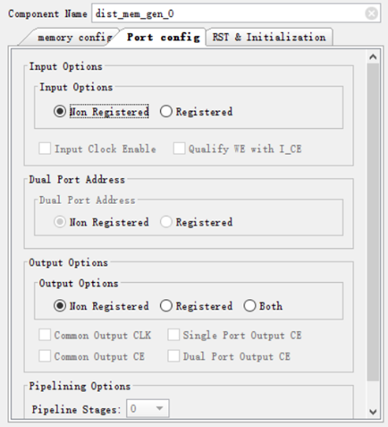
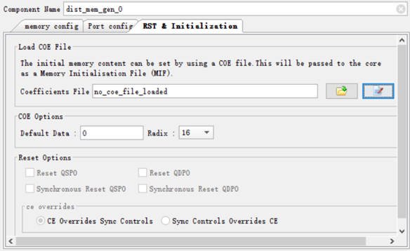
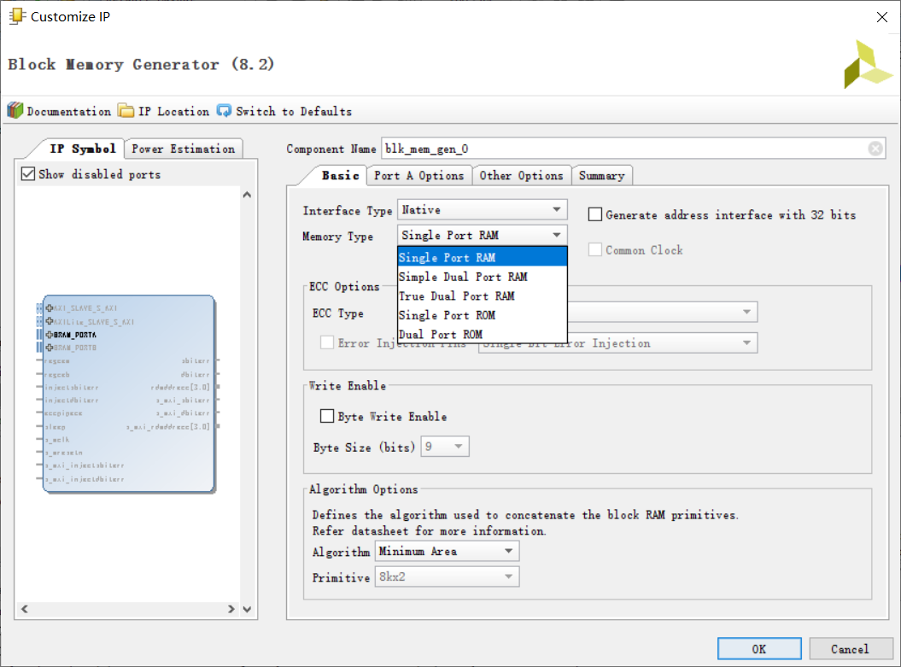
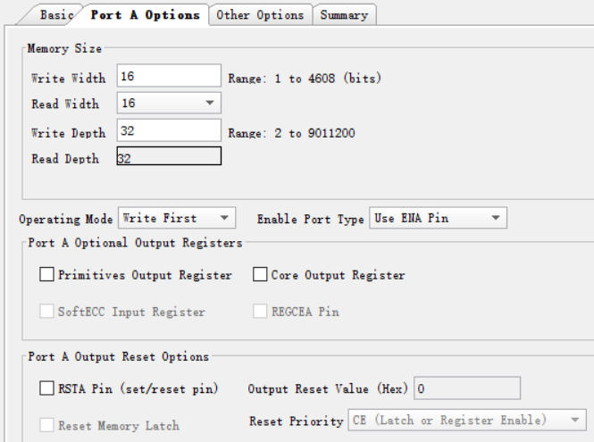
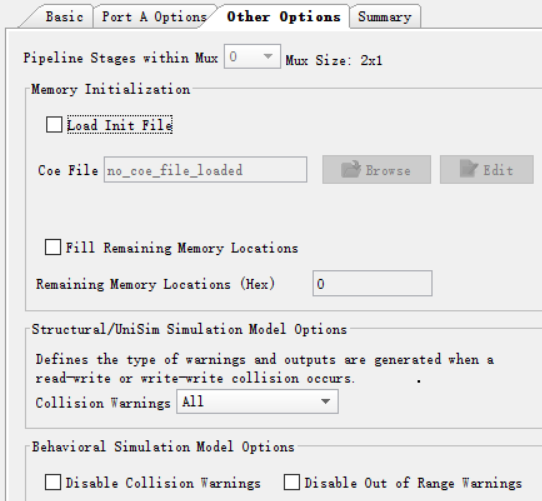

# 实验二 寄存器堆与队列

[TOC]

## 1 实验目标

1.  掌握寄存器堆（Register File）和存储器（Memory）的功能、时序及其应用；
2.  熟练掌握数据通路和控制器的设计和描述方法。

## 2 实验内容

### 2.1 寄存器堆

设计参数化的寄存器堆，其逻辑符号如图-1所示。该寄存器堆含有32
个寄存器（r0 ~r31，其中r0的内容恒定为零），寄存器的位宽由参数WIDTH指定，具有2个异步读端口和1个同步写端口。

{width="1.9416666666666667in"
height="1.2422681539807523in"}

<center>图-1 寄存器堆逻辑符号
</center>
参数化的寄存器堆端口声明如下：

```verilog
module register_file //32 x WIDTH寄存器堆
#(parameter WIDTH = 32) //数据宽度
(
    clk, //时钟（上升沿有效）
    input [4:0] ra0, //读端口0地址
    output [WIDTH-1:0] rd0, //读端口0数据
    input [4:0] ra1, //读端口1地址
    output [WIDTH-1:0] rd1, //读端口1数据
    input [4:0] wa, //写端口地址
    input we, //写使能，高电平有效
    input [WIDTH-1:0] wd //写端口数据
);

......

endmodule
```


### 2.2 存储器

存储器与寄存器堆的功能类似，都是用于存储信息，只是存储器的容量更大，配置方式更多，例如ROM/RAM、单端口/简单双端口/真正双端口、分布式/块式等方式。设计存储器可以通过行为方式描述，也可以通过IP例化方式实现。

例如，设计一容量为16 x
8位（即深度DEPTH：16，宽度WIDTH：8）的单端口RAM，其逻辑符号如图-2所示。用行为方式描述的Verilog代码如下：**（请补充代码中空缺的参数）**

{width="2.283333333333333in"
height="1.229070428696413in"}

<center>图-2 单端口RAM逻辑符号
</center>

```verilog
module ram_16x8 //16x8位单端口RAM

(input clk, //时钟（上升沿有效）
input en, we, //使能，写使能
input [ _____ ] addr, //地址
input [ _____ ] din, //输入数据
output [ _____ ] dout //输出数据
);
reg [ _____ ] addr_reg;
reg [ _____ ] mem[ _____ ];
//初始化RAM的内容
initial
\$readmemh("初始化数据文件名", mem);
assign dout = mem[addr_reg];
always@(posedge clk) begin
if(en) begin
addr_reg \<= addr;
if(we)
mem[addr] \<= din;
end
end
endmodule
```

Verilog HDL程序可以利用两个系统任务\$readmemb和\$readmemh，从文件中读取数据来初始化存储器。其语法格式（以\$readmemb为例，\$readmemh类似）如下：

```verilog
$readmemb(\"\<数据文件名\>\",\<存储器名\>,\<起始地址\>,\<终止地址\>);
```

数据文件是文本格式，只能包含空白（空格、换行、制表格tab）、注释和二进制（对于\$
readmemb）或十六进制数据（\$readmemh），数据中可以有不定值x或X、高阻值z或Z、或者下画线，但不能包含位宽书名和格式说明。起始地址和结束地址是可选的。当地址出现在数据文件中时，其格式是字符"@"后跟上十六进制数据，例如：\@hhhh。当读取中遇到地址说明符，会将地址后的数据存放到相应的地址中。

例如，从文件"rx.vec"中读取的第一个数字被存储在地址15中，下一个存储在地址16，并以此类推直到地址30。

```verilog
$readmemb(\"rx.vex\", MemA, 15, 30);
```

例如，文件init.vec内容如下：

```
@002
11111111  01010101
00000000  10101010
@006
1111zzzz  00001111
```

Verilog程序如下：

```verilog
reg [7:0] mem[0:7];
initial \$readmemb(\"init.vec\", mem);
```

则存储器中的内容如下：

```verilog
mem[0]=xxxxxxxx;
mem[1]=xxxxxxxx;
mem[2]=11111111;
mem[3]=01010101;
mem[4]=00000000;
mem[5]=10101010;
mem[6]=1111zzzz;
mem[7]=00001111;
```

通过Vivado例化存储器IP的配置界面如图-3\~8所示。配置时可以指定COE文件对存储器的内容初始化。COE文件包含两个分号结束的参数：memory_initialization_radix和memory_initialization_vector。前者说明数据进制，可以是2、10、16；后者列举出由空格或逗号分隔数据序列。

例如，初始化一个32x16 ROM的COE文件如下：

```verilog
memory_initialization_radix = 16;
memory_initialization_vector =
23f4, 0721, 11ff, ABe1, 0001, 1, 0A, 0,
23f4, 0721, 11ff, ABe1, 0001, 1, 0A, 0,
23f4, 721, 11ff, ABe1, 0001, 1, A, 0,
23f4, 721, 11ff, ABe1, 0001, 1, A, 0;
```

{width="5.6329855643044615in"
height="5.243055555555555in"}

<center>图-3 分布式存储器例化界面---存储器配置
</center>
{width="4.516666666666667in"
height="4.966666666666667in"}

<center>图-4 分布式存储器例化界面---端口配置
</center>
{width="6.083333333333333in" height="3.725in"}

<center>图-5 分布式存储器例化界面---复位和初始化
</center>
{width="6.757638888888889in" height="5.0in"}

<center>图-6 块式存储器例化界面---基本
</center>
{width="5.675145450568679in"
height="4.219949693788276in"}

<center>图-7 块式存储器例化界面---端口选项
</center>
{width="4.636181102362205in"
height="4.287625765529309in"}

<center>图-8 块式存储器例化界面---其他选项
</center>
### 2.3 先进先出（FIFO）队列


利用例化的存储器IP（16 x8位块式的单端口RAM）和适当的逻辑电路，设计实现数据宽度为8位、最大长度为16的FIFO队列，其逻辑符号如图-9所示。入队列使能（en_in）有效时，将输入数据（din）加入队尾；出队列使能（en_out）有效时，将队列头数据输出（dout）。队列数据计数（count）指示队列中有效数据个数。当队列满（count= 16）时不能执行入队操作，队列空（count =0）时不能进行出队操作。在入对使能信号的一次有效持续期间，仅允许最多入队一个数据，出队操作类似。

{width="2.3333333333333335in"
height="1.095686789151356in"}

<center>图-9 FIFO队列逻辑符号
</center>
该FIFO队列模块端口声明如下：

```verilog
module fifo
(input clk, rst, //时钟（上升沿有效）、异步复位（高电平有效）
input [7:0] din, //入队列数据
input en_in, //入队列使能，高电平有效
input en_out, //出队列使能，高电平有效
output [7:0] dout, //出队列数据
output [4:0] count //队列数据计数
);
......
endmodule
```

## 3 实验步骤

### 3.1 寄存器堆的编写和仿真

#### 3.1.1 寄存器堆的设计

 寄存器文件描述如下
```verilog
module RegFile
#(
    parameter WIDTH = 32,
    parameter REGFILE_WIDTH = 5
)
(
    input  clk, 
    input  rst, 

    input [REGFILE_WIDTH-1:0] ra0,      // 读端口输入
    output [WIDTH-1:0] rd0,             // 读端口输出
                                        
    input [REGFILE_WIDTH-1:0] ra1,      // 读端口输入
    output [WIDTH-1:0] rd1,             // 读端口输出
                                        
    input [REGFILE_WIDTH-1:0] wa,       // 写端口输入
    input  we,                          // 写端口使能
    input [WIDTH-1:0] wd                //	写端口输入数据
);
    localparam REGFILE_SIZE = (1 << REGFILE_WIDTH);
    reg [WIDTH-1:0] registers [REGFILE_SIZE-1:0];
    
    initial
        $readmemh("Y://Course/COLabs/lab2/src/marilog/regfile_data.vec", registers);
    
    assign rd0 = registers[ra0];
    assign rd1 = registers[ra1];
    
    always@(posedge clk)begin
        if(we) begin
            registers[wa] <= wd;
        end
    end
endmodule
```

#### 3.1.2 寄存器堆的仿真

 接下来进行寄存器文件的仿真。这里仿真代码首先逐一读取寄存器文件中初始化的内容，然后向寄存器倒序写入整数：31、30、29……，然后重新将这些数据读入。
```verilog
    integer i;
    initial begin
        regfile_we = 0;
        #10;
        $display("--- first read regfile ---"); 
        for(i = 0; i < 32; i=i+1) begin                    // 首先逐一读取寄存器文件中初始化的内容
            regfile_ra0 = i;                               
            regfile_ra1 = i+1;                             
            #10;                                           
            $display("read %d at %d", regfile_rd0, i);     
        end                                                
        $display("--- write to read regfile ---");         
        regfile_we = 1;                                    
        for(i = 0; i < 32; i=i+1) begin                    // 倒序写入整数
            regfile_wa = i;                                
            regfile_wd = 31 - i;                           
            #10;                                           
            $display("write %d to %d", 31 - i, i);         
        end                                                
        regfile_we = 0;                                    
        $display("--- read the writed regfile ---");       
        for(i = 0; i < 32; i=i+1) begin                    // 检查写入的结果
            regfile_ra0 = i;
            regfile_ra1 = i+1;
            #10;
            $display("read %d at %d", regfile_rd0, i);
        end
        $finish;
    end
```

 仿真得到的波形和文本如下：

 

 

 

### 3.2  分布式和块式单端口RAM的实现与仿真

### 3.3  设计FIFO队列电路的设计和仿真

#### 3.1.1 FIFO队列的设计

 接下来编写队列模块
```verilog
module FIFO
#(
    parameter WIDTH = 8,
    parameter MEM_ADDR_WIDTH = 4
)
(
    input  clk, 
    input  rst, 

    input  en_in,                            // 入队使能信号（同步上升沿有效）
    input [WIDTH-1:0] din,                   // 入队数据
                                             
    input  en_out,                           // 出队使能信号（同步上升沿有效）
    output [WIDTH-1:0] dout,                 // 出队数据
                                             
    output reg [MEM_ADDR_WIDTH:0] count      // 队列元素个数
);
    reg [MEM_ADDR_WIDTH-1:0] head, tail;
    wire push;

    // 上升信号检测电路
    wire  en_in_rising;
    rising_detect en_in_inst (
    	.clk(clk),
    	.rst(rst),
    	.y(en_in),
    	.rising(en_in_rising)
    );
    wire  en_out_rising;
    rising_detect en_out_inst (
    	.clk(clk),
    	.rst(rst),
    	.y(en_out),
    	.rising(en_out_rising)
    );
    
    dist_mem_gen_0 dist_mem_gen_0 (
        .a(head),
        .d(din),
        .dpra(tail),
        .clk(clk),
        .dpo(dout),
        .we(push)
    );
    
    // 计算队列元素个数
    always@(*) begin
        if(full)
            count = 16;
        else if(head < tail)
            count = 16 + head - tail;
        else
            count = head - tail;
    end

    // push表示何时入队
    assign push = en_in_rising && !full;
    
    // full 信号用来在 head == tail 时区分空和满两种情况。
    reg full;
    always @(posedge clk or posedge rst) begin
        if(rst) begin
            head <= 0;
            full <= 0;
            tail <= 0;
        end
        else if(en_out_rising && count != 0) begin
            // 出队
            tail <= tail + 1;
            if(full)
                full <= 0;
        end
        else if(en_in_rising && !full) begin
            // 入队
            head <= head + 1;
            if(count == 15)
                full <= 1;
        end
    end
    
endmodule
```

#### 3.1.2 FIFO队列的仿真


 下面对fifo队列进行仿真，代码如下：
```verilog
    task assert; // 用于测试
    input test;
    begin
        if(~test) begin
            $display("assert failed");
            $finish;
        end
    end
    endtask
    
    initial begin
        en_in = 0;  en_out=0;
        #10;
        // 将16个数逐个入队
        for(i = 0; i < 16; i=i+1) begin
            en_in = 1; fifo_din = i; en_out = 0;
            assert(fifo_count == i);
            #10;
            en_in = 0; en_out = 0;
            #10;
        end
        assert(fifo_count == 16);                // 已经入队了16个
        // 尝试入队第17个                              
        en_in = 1; fifo_din = i; en_out = 0;     
        #10;                                     
        en_in = 0; en_out = 0;                   
        #10;                                     
                                                 
        assert(fifo_count == 16);                // 第17个无法入队
                                                 
         // 取出16个数                               
        for(i = 0; i < 16; i=i+1) begin          
            en_in = 0; en_out = 1;               
            assert(fifo_count == 16 - i);        
            #10;                                 
            en_in = 0; en_out = 0;               
            $display("get %d", fifo_dout);       
            assert(fifo_dout == i);              // 检验读出的结果
            #10;                                 
        end                                      
        assert(fifo_count == 0);                 // 队列已空
    end
```

 以上 `assert` 全部通过，得到波形如下图所示：

 

 并且有完整的文本输出：

 

### 3.4  FIFO队列电路在FPGA中的测试

    din对应SW7 ~ SW0，dout对应LED7 ~ LED0，count对应LED15\~LED11，en_in对应BTNU，en_out对应BTND，clk对应100
    MHz时钟（clk100mhz），rst对应BTNL。

## 5 思考题


### 5.1  如何利用寄存器堆和适当电路设计实现可变个数的数据排序电路？

