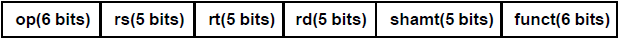
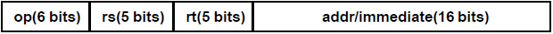
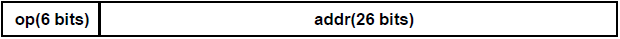
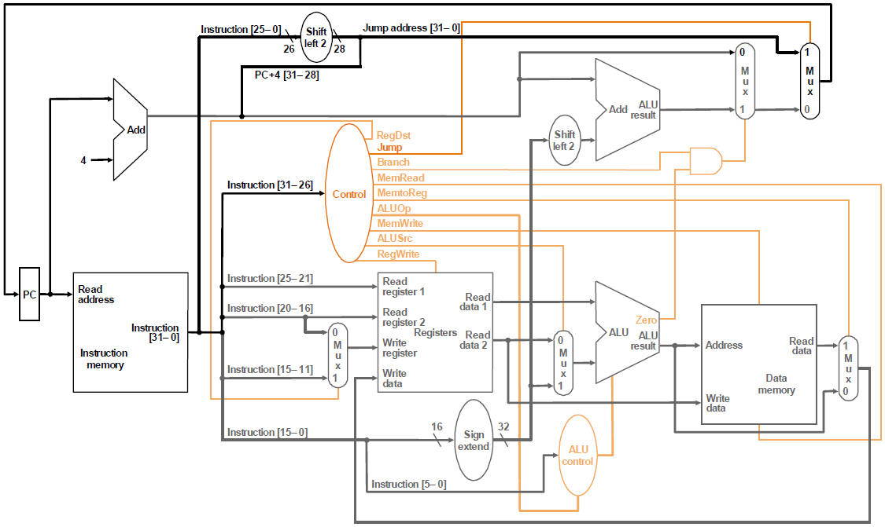
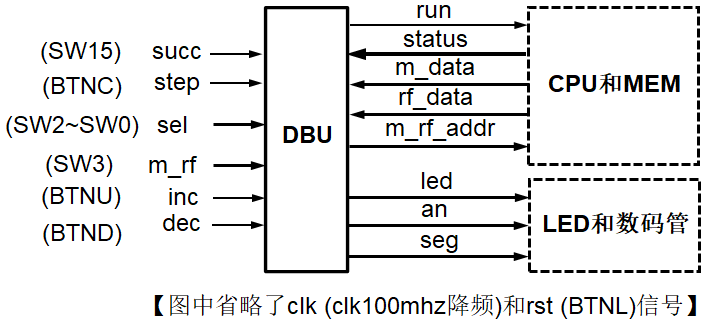
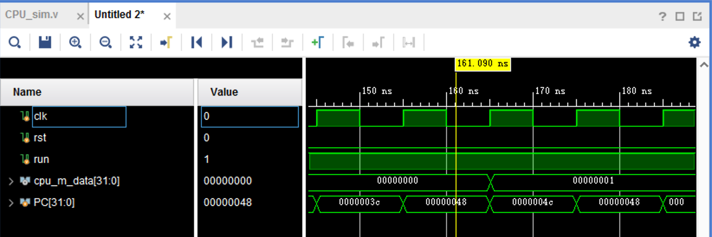
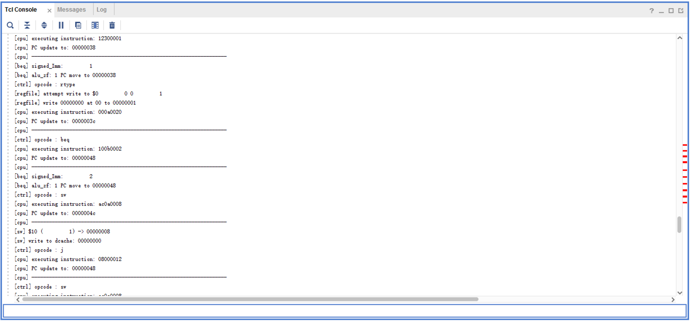
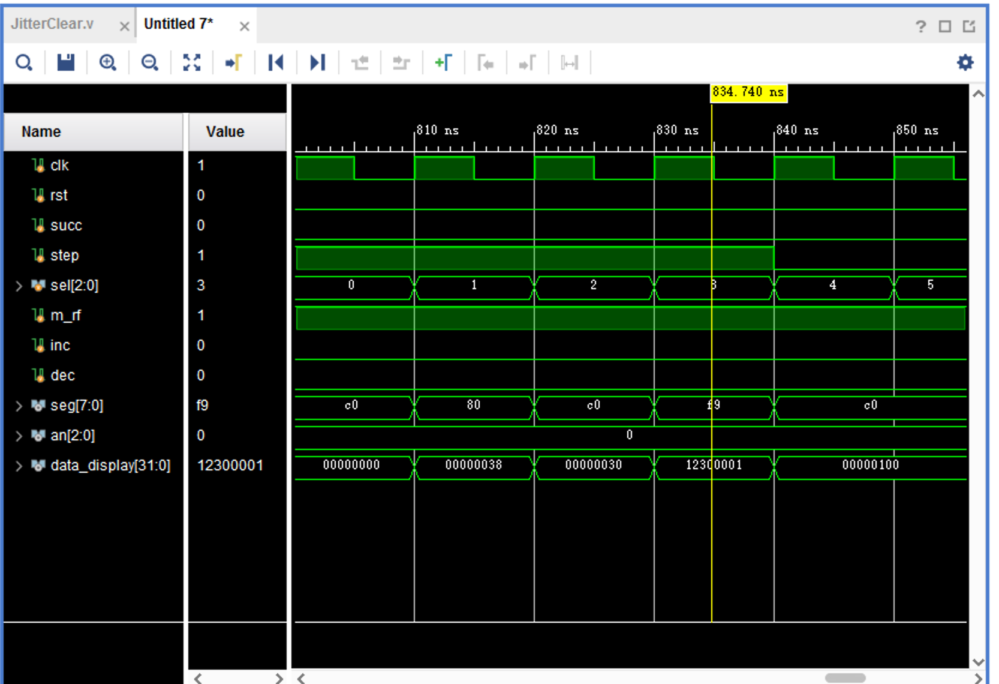
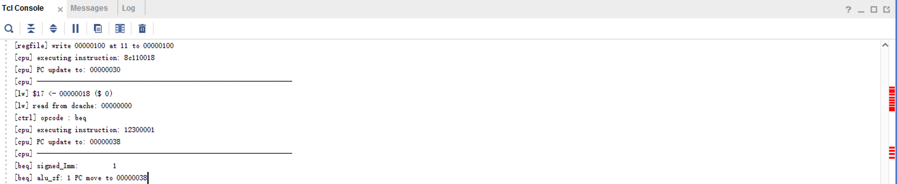

# 实验三 单周期CPU

## 1 实验目标

* 理解计算机硬件的基本组成、结构和工作原理。
* 掌握数字系统的设计和调试方法。
* 熟练掌握数据通路和控制器的设计和描述方法。

## 2 实验内容

### 2.1 单周期CPU


待设计的单周期CPU可以执行如下6条指令：

- **add**: rd \<- rs + rt; op = 000000, funct = 100000

    {width="5.09375in" height="0.3282250656167979in"}

- **addi**: rt \<- rs + imm; op = 001000

- **lw**: rt \<- M(rs + addr); op = 100011

- **sw**: M(rs + addr) \<- rt; op = 101011

- **beq**:

    ```verilog
    if (rs = rt) then pc <- pc + 4 + addr \<\< 2
    else pc <- pc + 4; op = 000100
    ```

{width="5.114583333333333in"
height="0.32169510061242346in"}

-   **j**: pc \<- (pc+4)\[31:28\] \| (add\<\<2)\[27:0\]; op = 000010

{width="5.114583333333333in"
height="0.3216940069991251in"}

待设计的CPU的逻辑符号如图-1所示，端口声明如下：


```verilog
module cpu_one_cycle //单周期CPU
(
    input clk, //时钟（上升沿有效）
    input rst //异步复位，高电平有效
);

    ......

endmodule
```

{width="1.1666666666666667in"
height="0.5938910761154855in"}
<center>图-1 CPU逻辑符号</center>

分析以上待实现指令的功能，设计CPU的数据通路和控制单元（橙色部分）如图-2所示，其中ALU和寄存器堆可以利用实验1和实验2设计的模块来实现，指令存储器ROM和数据存储器RAM均采用IP例化实现，容量为256 x 32位的分布式存储器。

{width="6.15625in" height="3.671894138232721in"}

<center>图-2 单周期CPU逻辑框图
</center>

### 2.2 调试单元（Debug Unit，DBU）


为了方便下载调试，设计一个调试单元DBU，该单元可以用于控制CPU的运行方式，显示运行过程的中间状态和最终运行结果。

DBU的端口与CPU以及FPGA开发板外设（拨动/按钮开关、LED指示灯、7-段数码管）的连接如图-3所示。为了DBU在不影响CPU运行的情况下，随时监视CPU运行过程中寄存器堆和数据存储器的内容，可以为寄存器堆和数据存储器增加1个用于调试的读端口。

{width="4.958333333333333in"
height="2.265488845144357in"}

<center>图-3 调试单元端口及其连接图
</center>
-   控制CPU运行方式


-   `succ = 1`: 控制CPU连续执行指令，run = 1（一直维持）

-   `succ = 0`: 控制CPU执行一条指令，每按动step一次，run输出维持一个时钟周期的脉冲


-   `sel = 0`: 查看CPU运行结果 (存储器或者寄存器堆内容)


-   `m_rf`： 1，查看存储器(MEM)；0，查看寄存器堆(RF)

-   `m_rf_addr`： MEM/RF的调试读口地址(字地址)，复位时为零

-   `inc/dec`：`m_rf_addr`加1或减1

-   `rf_data/m_data`：从RF/MEM读取的数据字

-   16个LED指示灯显示 `m_rf_addr`

-   8个数码管显示 `rf_data/m_data`


-   `sel = 1 \~ 7 ` ：查看CPU运行状态（status）


-   12个LED指示灯(SW11\~SW0)依次显示控制器的控制信号 `Jump, Branch, Reg\_Dst, RegWrite, MemRead, MemtoReg, MemWrite, ALUOp, ALUSrc, ALUZero`，其中ALUOp为3位。

-   8个数码管显示由sel选择的一个32位数据

-   `sel = 1`：`pc_in`, PC的输入数据

-   `sel = 2`：`pc_out`, PC的输出数据

-   `sel = 3`：`instr`, 指令存储器的输出数据

-   `sel = 4`：`rf_rd1`, 寄存器堆读口1的输出数据

-   `sel = 5`：`rf_rd2`, 寄存器堆读口2的输出数据

-   `sel = 6`：`alu_y`, ALU的运算结果

-   `sel = 7`：`m_rd`, 数据存储器的输出数据

## 3 实验步骤

### 3.1  单周期CPU的设计和仿真

#### 3.1.1 CPU 的指令集层设计

对MIPS中 `opcode` 和 `funct` 分别进行定义如下：

##### 指令 `opcode`

```verilog
// instrucitons:
// opcode rtype 
`define OPCODE_RTYPE = 6'b000000
// opcode addi 
`define OPCODE_ADDI = 6'b001000
// opcode lw 
`define OPCODE_LW = 6'b100011
// opcode sw 
`define OPCODE_SW = 6'b101011
// opcode beq 
`define OPCODE_BEQ = 6'b000100
// opcode j 
`define OPCODE_J = 6'b000010
```

##### rtype指令 `funct`

```verilog
// Functs:
// funct add(6'b100000) 
`define FUNCT_ADD 6'b100000
// funct addu(6'b100001) 
`define FUNCT_ADDU 6'b100001
// funct sub(6'b100010) 
`define FUNCT_SUB 6'b100010
// funct subu(6'b100011) 
`define FUNCT_SUBU 6'b100011
// funct and(6'b100100) 
`define FUNCT_AND 6'b100100
// funct or(6'b100101) 
`define FUNCT_OR 6'b100101
// funct xor(6'b100110) 
`define FUNCT_XOR 6'b100110
// funct accm(6'b101000) 
`define FUNCT_ACCM 6'b101000
```

##### 控制单元 Signal 

控制单元 Signal 的定义如下：（与讲义定义相同，这里统一了变量书写形式（小写蛇形））

```verilog
// Signal's structure
// -  jump (1) : 跳转指令专用（j，jal）
// -  branch (1) : branch 指令专用
// -  reg_write (1) 
// -  reg_dst (1) 
`define RegDst_Rd 1'b1
`define RegDst_Rt 1'b0
// -  mem_read (1) 
// -  mem_toreg (1) : DCache出口处的mux
`define MemToReg_Mem 1'b1
`define MemToReg_ALU 1'b0
// -  mem_write (1) 
// -  aluop (3) : 传入ALU_Control
`define ALUOp_CMD_RTYPE 3'd0
`define ALUOp_CMD_ADD 3'd1
`define ALUOp_CMD_SUB 3'd2
`define ALUOp_CMD_AND 3'd3
`define ALUOp_CMD_OR 3'd4
`define ALUOp_CMD_XOR 3'd5
`define ALUOp_CMD_NOR 3'd6
`define ALUOp_CMD_LU 3'd7
// -  alu_src2 (2) 
`define ALUSrc2_Reg 2'd0
`define ALUSrc2_SImm 2'd1
`define ALUSrc2_UImm 2'd2
// -  branch_neq (1) 
```

#### 3.1.2 CPU的设计

##### 数据通路设计

 CPU设计的代码和思路具体见（https://github.com/DnailZ/COLabs/blob/master/lab3/src/verilog/logic/CPU.v）
```verilog
module CPU
#(
    parameter STATUS_W = 237,
    parameter SIGNAL_W = 13,
    parameter REG_W = 5,
    parameter WIDTH = 32,
    parameter FUNCT_W = 6,
    parameter OPCODE_W = 6,
    parameter ALUOP_W = 3
) (
    input  clk, 
    input  rst, 
    input  run, 
    input [7:0] m_rf_addr, 
    output [STATUS_W-1:0] status, 
    output [WIDTH-1:0] m_data, 
    output [WIDTH-1:0] rf_data 
);
    // 下将 CPU 分为五个阶段分别编写，会在下面的章节逐个展开
     ......
endmodule
```

 ##### FI 段

 FI 段，编写 PC 和 ICache（ICache 用 dist_mem_gen 实现），并且将 `next_PC` 写入PC。
```verilog
    // -----------------------------------
    // FETCH INSTRUCTION
    // -----------------------------------
    reg [WIDTH-1:0] PC;
    wire [WIDTH-1:0] instruction;
    dist_mem_gen_0 icache(
        .clk(clk),
        .a(PC[9:2]),
        .spo(instruction),
        .we(0)
    );

    reg [WIDTH-1:0] next_PC;
    always@(posedge clk or posedge rst) begin
        if(rst)
            PC <= 0;
        else if(run)
            PC <= next_PC;
    end
```

 ##### ID 段

 ID 段，编写控制模块和寄存器文件

 除此之外，ID 段还应该完成立即数的符号扩展。（在这里保持良好的可扩展性，添加了无符号扩展，可以对 `andi`, `ori` 等指令提供支持）

 注：这里用 `sgn` 表示 CPU 的控制信号
```verilog
    // -----------------------------------
    // DECODE INSTRUCTION
    // -----------------------------------

    wire [SIGNAL_W-1:0] sgn; // sgn 表示 signal
    Control ctrl (
        .clk(clk),
        .rst(rst),
        .run(run),
    	.opcode(instruction [31:26] ),
    	.sgn(sgn)
    );
    wire sgn_jump;
    wire sgn_branch;
    wire sgn_reg_write;
    wire sgn_reg_dst;
    wire sgn_mem_read;
    wire sgn_mem_toreg;
    wire sgn_mem_write;
    wire [2:0] sgn_aluop;
    wire [1:0] sgn_alu_src2;
    wire sgn_branch_neq;
    assign { sgn_jump, sgn_branch, sgn_reg_write, sgn_reg_dst, sgn_mem_read, sgn_mem_toreg, sgn_mem_write, sgn_aluop, sgn_alu_src2, sgn_branch_neq} = sgn;

    wire [WIDTH-1:0] regfile_rd0;
    wire [WIDTH-1:0] regfile_rd1;
    wire [REG_W-1:0] regfile_wa;
    wire  regfile_we;
    wire [WIDTH-1:0] regfile_wd;
    
    RegFile regfile (
    	.clk(clk),
    	.rst(rst),
    	.m_rf_addr(m_rf_addr),
    	.rf_data(rf_data),
    	.ra0(instruction [25:21] ),
    	.ra1(instruction [20:16] ),
    	.rd0(regfile_rd0),
    	.rd1(regfile_rd1),
    	.wa(regfile_wa),
    	.we(regfile_we),
    	.wd(regfile_wd)
    );
    
    wire [15:0] Imm = instruction [15:0] ;
    wire [WIDTH-1:0] signed_Imm = {{16{Imm[15]}}, Imm};
    wire [WIDTH-1:0] unsigned_Imm = {{16{0}}, Imm}; // 无符号数扩展

```

 ##### EX 段
 EX 段，编写 ALU 以及其控制模块，

 ALU 控制模块将会将 `funct` 和控制模块的 `aluop` 转化为 ALU 的 `alu_m`。

 `alu_src2` 处应当有一个选择 `alu_b` 的选择器
```verilog
    // -----------------------------------
    // EXECUTE INSTRUCTION
    // -----------------------------------

    wire [ALUOP_W-1:0] aluctrl_alu_m;
    wire [1:0] aluctrl_alu_src1;
    wire  aluctrl_mem_addr_mux;
    
    ALU_control aluctrl (
    	.aluop(sgn_aluop),
    	.funct(instruction [5:0] ),
    	.alu_m(aluctrl_alu_m),
    	.alu_src1(aluctrl_alu_src1),
    	.mem_addr_mux(aluctrl_mem_addr_mux)
    );

    reg [WIDTH-1:0] alu_a;
    reg [WIDTH-1:0] alu_b;
    always @(*) begin
        alu_a = 0;
        alu_b = 0;
        case(sgn_alu_src2)
        `ALUSrc2_Reg: alu_b = regfile_rd1;
        `ALUSrc2_SImm: alu_b = signed_Imm;
        `ALUSrc2_UImm: alu_b = unsigned_Imm;
        default: alu_b = 0;
        endcase
        case(aluctrl_alu_src1)
        `ALUSrc1_Rs: alu_a = regfile_rd0;
        `ALUSrc1_Shamt: alu_a = instruction [10:6];
        `ALUSrc1_Mem: alu_a = mem_rd; // especially for accm instruction
        default: alu_a = 0;
        endcase
    end

    wire [WIDTH-1:0] alu_y;
    wire  alu_zf;
    wire  alu_cf;
    wire  alu_of;
    // ALU控制单元（https://github.com/DnailZ/COLabs/blob/master/lab3/src/verilog/logic/CPU.v）
    ALU alu (
    	.a(alu_a),
    	.b(alu_b),
    	.m(aluctrl_alu_m),
    	.y(alu_y),
    	.zf(alu_zf),
    	.cf(alu_cf),
    	.of(alu_of)
    );
    wire [WIDTH-1:0] alu_out = alu_y;

```

 ##### MEM 段

 MEM 段，编写 DCache （DCache 用 dist_mem_gen 实现），同时求出 `next_PC`
```verilog
    // -----------------------------------
    // MEMORY
    // -----------------------------------

    wire mem_write = sgn_mem_write & run;
    wire [WIDTH-1:0] mem_rd;
    wire mem_addr =
        (aluctrl_mem_addr_mux == `MemAddrMux_ALU)? alu_out : regfile_rd0;
    dist_mem_gen_1 dcache(
        .clk(clk),
        .a(mem_addr[9:2]),
        .d(regfile_rd1),
        .we(mem_write),
        .spo(mem_rd),
        .dpra(m_rf_addr),
        .dpo(m_data)
    );

    wire [WIDTH-1:0] nPC = PC + 4;
    always @(*) begin
        if(sgn_jump)
            next_PC = {nPC[31:28], instruction [25:0] , 2'b00};
        else if(sgn_branch & alu_zf)
            next_PC = {signed_Imm[29:0], 2'b00} + nPC;
        else
            next_PC = nPC;
    end
```

 ##### WB 段

 WB 段，regfile 写入的内容。
```verilog
    // -----------------------------------
    // WRITEBACK
    // -----------------------------------

    assign regfile_wa = (sgn_reg_dst == `RegDst_Rt)? instruction [20:16] : instruction [15:11] ;
    assign regfile_we = sgn_reg_write;
    assign regfile_wd = (sgn_mem_toreg == `MemToReg_Mem)? mem_rd : alu_out;

```

 ##### Debug 信息

 DBU 所需要的 status 和指令信息。
```verilog
    // -----------------------------------
    // DEBUG MESSAGE
    // -----------------------------------

    assign status = {      //
        sgn,               // signal
        next_PC,           // next_pc
        PC,                // pc
        instruction,       // instruction
        regfile_rd1,       // regfile_rd0
        regfile_rd1,       // regfile_rd1
        alu_out,           // alu_out
        mem_rd             // mem_rd
    };                     //

    `ifndef SYSTHESIS
    always @(posedge clk) begin
        if(~rst & run) begin
            $display("[cpu] executing instruction: %h", instruction);
            $display("[cpu] PC update to: %h", next_PC);
            $display("[cpu] ------------------------------------------------------------------- ");
        end
    end
    always @(posedge clk) begin
        if(~rst & run) begin
            if(sgn_mem_read) begin
                $display("[lw] $%d <- %h ($%d)", instruction [20:16] , alu_out, instruction [25:21] );
                #1 $display("[lw] read from dcache: %h", mem_rd);
            end
        end
    end
    always @(posedge clk) begin
        if(~rst & run) begin
            if(mem_write) begin
                $display("[sw] $%d (%d) -> %h", instruction [20:16], regfile_rd1, alu_out);
                #1 $display("[sw] write to dcache: %h", regfile_rd1);
            end
        end
    end
    always @(posedge clk) begin
        if(~rst & run) begin
            if(sgn_branch) begin
                $display("[beq] signed_Imm:", signed_Imm);
                $display("[beq] alu_zf: %d PC move to %h", alu_zf, next_PC);
            end
        end
    end
    `endif
```

 ##### 控制单元
```verilog
module Control
#(
     ......
) (
    input  clk, 
    input  rst, 
    input  run, 
    input [5:0] opcode, 
    output reg [SIGNAL_W-1:0] sgn // signals
);

    always @(*) begin
        sgn = 0;
        case(opcode)
    `OPCODE_RTYPE:
         sgn = {                   //
            1'b0,                  // jump (by default)
            1'b0,                  // branch (by default)
            1'h1,                  // reg_write
            `RegDst_Rd,            // reg_dst
            1'bx,                  // mem_read (by default)
            `MemToReg_ALU,         // mem_toreg
            1'b0,                  // mem_write (by default)
            `ALUOp_CMD_RTYPE,      // aluop
            `ALUSrc2_Reg,          // alu_src2
            1'b0                   // branch_neq (by default)
        };                         //
    `OPCODE_ADDI:
         sgn = {                 //
            1'b0,                // jump (by default)
            1'b0,                // branch (by default)
            1'h1,                // reg_write
            `RegDst_Rt,          // reg_dst
            1'bx,                // mem_read (by default)
            `MemToReg_ALU,       // mem_toreg
            1'b0,                // mem_write (by default)
            `ALUOp_CMD_ADD,      // aluop
            `ALUSrc2_SImm,       // alu_src2
            1'b0                 // branch_neq (by default)
        };                       //
     ......
    default:
         sgn = {         //
            1'b0,        // jump (by default)
            1'b0,        // branch (by default)
            1'b0,        // reg_write (by default)
            1'bx,        // reg_dst (by default)
            1'bx,        // mem_read (by default)
            1'bx,        // mem_toreg (by default)
            1'b0,        // mem_write (by default)
            3'bxxx,      // aluop (by default)
            2'bxx,       // alu_src2 (by default)
            1'b0         // branch_neq (by default)
        };               //
        endcase
    end

    `ifndef SYSTHESIS
    // 调试输出
    always @(posedge clk) begin
        if(~rst & run) begin
            case(opcode)
            `OPCODE_RTYPE: $display("[ctrl] opcode : rtype");
            `OPCODE_ADDI: $display("[ctrl] opcode : addi");
            `OPCODE_LW: $display("[ctrl] opcode : lw");
            `OPCODE_SW: $display("[ctrl] opcode : sw");
            `OPCODE_BEQ: $display("[ctrl] opcode : beq");
            `OPCODE_J: $display("[ctrl] opcode : j");
            default:;
            endcase
        end
    end
    `endif
    
endmodule
```

#### 3.1.3 CPU的仿真

运行助教给定的代码，得到如下结果：





助教的代码运行成功（CPU在PC=0x48-4c的时候将 8 处设为 1），并且可以通过输出来具体地检查运行过程。

### 3.2  DBU的设计和仿真

#### 3.2.1 DBU的设计

```verilog
module DBU
#(
    parameter STATUS_W = 237,
    parameter SIGNAL_W = 13,
    parameter REG_W = 5,
    parameter WIDTH = 32,
    parameter FUNCT_W = 6,
    parameter OPCODE_W = 6,
    parameter ALUOP_W = 3
) (
    input  clk, 
    input  rst, 
    input  succ, 
    input  step, 
    input [2:0] sel, 
    input  m_rf, 
    input  inc, 
    input  dec, 
    output [7:0] seg, 
    output [2:0] an, 
    output reg [31:0] data_display, 
    output reg [16:0] led 
);
    // 本来是需要对这些信号做除抖动的，这里为了仿真暂时省略
    wire  step_rising;
    RisingDetect step_inst (
    	.clk(clk),
    	.rst(rst),
    	.y(step),
    	.rising(step_rising)
    );
    wire  inc_rising;
    RisingDetect inc_inst (
    	.clk(clk),
    	.rst(rst),
    	.y(inc),
    	.rising(inc_rising)
    );
    wire  dec_rising;
    RisingDetect dec_inst (
    	.clk(clk),
    	.rst(rst),
    	.y(dec),
    	.rising(dec_rising)
    );

    // m_rf_addr 的增加和减少。
    reg [7:0] m_rf_addr;
    always@(posedge clk or posedge rst) begin
        if(rst)
            m_rf_addr <= 0;
        else if(inc_rising)
            m_rf_addr <= m_rf_addr + 1;
        else if(dec_rising)
            m_rf_addr <= m_rf_addr - 1;
        else
            m_rf_addr <= m_rf_addr;
    end

    wire run = succ | step_rising;
    wire [STATUS_W-1:0] status;
    wire [WIDTH-1:0] m_data, rf_data;
    CPU CPU_debug (
        .clk(clk),
        .rst(rst),
        .run(run),
        .m_rf_addr(m_rf_addr),
        .status(status),
        .m_data(m_data),
        .rf_data(rf_data)
    );

    wire [12:0] status_signal;
    wire [31:0] status_next_pc;
    wire [31:0] status_pc;
    wire [31:0] status_instruction;
    wire [31:0] status_regfile_rd0;
    wire [31:0] status_regfile_rd1;
    wire [31:0] status_alu_out;
    wire [31:0] status_mem_rd;
    assign { status_signal, status_next_pc, status_pc, status_instruction, status_regfile_rd0, status_regfile_rd1, status_alu_out, status_mem_rd} = status;
	
    // data_display 的选择。
    always@(*) begin
        case(sel)
            0: begin
                if(m_rf)
                    data_display = m_data;
                else
                    data_display = rf_data;
            end
            1: data_display = status_next_pc;
            2: data_display = status_pc;
            3: data_display = status_instruction;
            4: data_display = status_regfile_rd0;
            5: data_display = status_regfile_rd1;
            6: data_display = status_alu_out;
            7: data_display = status_mem_rd;
        endcase
    end
    
    // LED 输出
    always @(*) begin
        if(sel == 0) 
            led = m_rf_addr;
        else led = status_signal;
    end
    
    // 管子输出
    
    Display display (
    	.clk(clk),
    	.seg(seg),
    	.an(an),
    	.data_display(data_display)
    );
    
endmodule
```

#### 3.2.2 DBU的仿真

仿真方法：在每一次step的时候，我们会将所有sel 遍历一遍，然后再执行下一步，具体效果如下。

我们观察一个特定的指令，如一个 `beq` 指令，可以看到这个指令，在 `sel=1` 时 `data_display(next_PC)=0x38` 而`sel=2` 时 `data_display(PC)=0x30`  。与下面的文本输出对比，就会发现beq往后跳转了一个指令。





### 3.3  将CPU和DBU下载至FPGA中测试：

>  端口与FPGA开发板N4-DDR的外设的连接关参见图-3所示。

## 4 实验检查


### 4.1  单周期CPU的功能仿真


### 4.2  调试单元DBU的功能仿真


### 4.3  CPU和DBU下载至FPGA后的运行功能


## 5 思考题

1. 修改数据通路和控制器，增加支持如下指令：

accm: rd \<- M(rs) + rt; op = 000000, funct = 101000

{width="5.083333333333333in"
height="0.3275535870516185in"}
