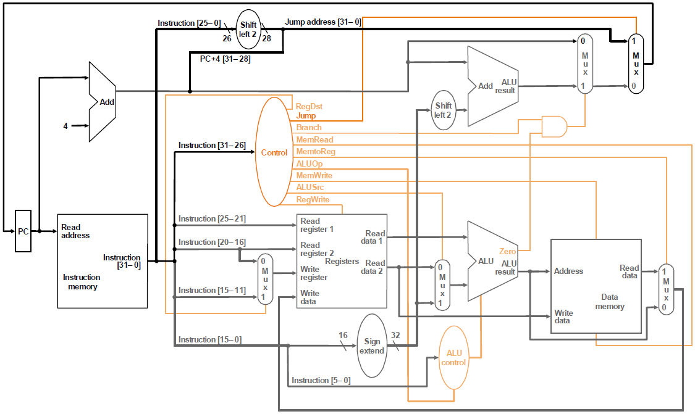
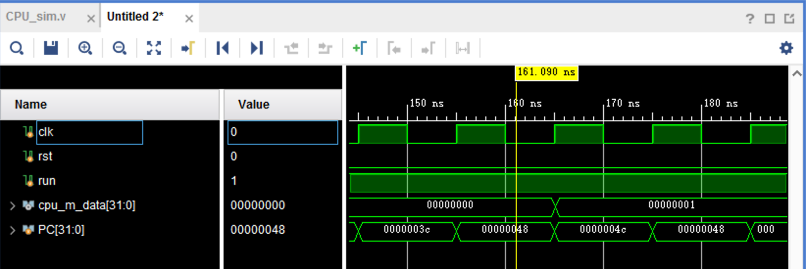

# 实验三 单周期CPU

**注：本实验的完整代码可以在https://github.com/DnailZ/COLabs/tree/master/lab3/src/verilog下找到**

[TOC]

## 1 实验目标

* 理解计算机硬件的基本组成、结构和工作原理。
* 掌握数字系统的设计和调试方法。
* 熟练掌握数据通路和控制器的设计和描述方法。

## 2 实验内容

### 2.1 单周期CPU

依照讲义要求，设计单周期CPU指令如下：

> 待设计的单周期CPU可以执行如下6条指令：
> 
> - **add**: rd \<- rs + rt; op = 000000, funct = 100000
> 
>     {width="5.09375in" height="0.3282250656167979in"}
> 
> - **addi**: rt \<- rs + imm; op = 001000
> 
> - **lw**: rt \<- M(rs + addr); op = 100011
> 
> - **sw**: M(rs + addr) \<- rt; op = 101011
> 
> - **beq**:
> 
>     ```verilog
>     if (rs = rt) then pc <- pc + 4 + addr \<\< 2
>     else pc <- pc + 4; op = 000100
>     ```
> 
> {width="5.114583333333333in"
> height="0.32169510061242346in"}
> 
> -   **j**: pc \<- (pc+4)\[31:28\] \| (add\<\<2)\[27:0\]; op = 000010
> 
> {width="5.114583333333333in"
> height="0.3216940069991251in"}
> 

依照讲义要求，待设计的CPU的逻辑符号如图-1所示，端口声明如下：

```verilog
module cpu_one_cycle //单周期CPU
(
    input clk, //时钟（上升沿有效）
    input rst //异步复位，高电平有效
);

    ......

endmodule
```

{width="1.1666666666666667in"
height="0.5938910761154855in"}
<center>图-1 CPU逻辑符号</center>


设计通路参考讲义：

{width="6.15625in" height="3.671894138232721in"}

<center>图-2 单周期CPU逻辑框图
</center>

### 2.2 调试单元（Debug Unit，DBU）


为了方便下载调试，我们还要另行设计一个 DBU 用来调试。其端口设计如下：


{width="4.958333333333333in"
height="2.265488845144357in"}

<center>图-3 调试单元端口及其连接图
</center>


依照讲义要求，将CPU的控制方式设计如下：


 -   `succ = 1`: 控制CPU连续执行指令，run = 1（一直维持）

 -   `succ = 0`: 控制CPU执行一条指令，每按动step一次，run输出维持一个时钟周期的脉冲


 -   `sel = 0`: 查看CPU运行结果 (存储器或者寄存器堆内容)


 -   `m_rf`： 1，查看存储器(MEM)；0，查看寄存器堆(RF)

 -   `m_rf_addr`： MEM/RF的调试读口地址(字地址)，复位时为零

 -   `inc/dec`：`m_rf_addr`加1或减1

 -   `rf_data/m_data`：从RF/MEM读取的数据字

 -   16个LED指示灯显示 `m_rf_addr`

 -   8个数码管显示 `rf_data/m_data`


 -   `sel = 1 \~ 7 ` ：查看CPU运行状态（status）


 -   12个LED指示灯(SW11\~SW0)依次显示控制器的控制信号 `Jump, Branch, Reg\_Dst, RegWrite, MemRead, MemtoReg, MemWrite, ALUOp, ALUSrc, ALUZero`，其中ALUOp为3位。

 -   8个数码管显示由sel选择的一个32位数据

 -   `sel = 1`：`pc_in`, PC的输入数据

 -   `sel = 2`：`pc_out`, PC的输出数据

 -   `sel = 3`：`instr`, 指令存储器的输出数据

 -   `sel = 4`：`rf_rd1`, 寄存器堆读口1的输出数据

 -   `sel = 5`：`rf_rd2`, 寄存器堆读口2的输出数据

 -   `sel = 6`：`alu_y`, ALU的运算结果

 -   `sel = 7`：`m_rd`, 数据存储器的输出数据

## 3 实验步骤

### 3.1  单周期CPU的设计和仿真

#### 3.1.1 CPU 的指令集层设计

对MIPS中 `opcode` 和 `funct` 分别进行定义如下：

##### 指令 `opcode`

rep[instr]

##### rtype指令 `funct`

rep[funct]

##### 控制单元 Signal 

控制单元 Signal 的定义如下：（与讲义定义相同，这里统一了变量书写形式（小写蛇形））

rep[sgn]

#### 3.1.2 CPU的设计

##### 数据通路设计

rep[cpu]

rep[stages]

rep[ctrl]

#### 3.1.3 CPU的仿真

运行助教给定的代码，得到如下结果：




助教的代码运行成功（CPU在PC=0x48-4c的时候将 8 处设为 1），并且可以通过输出来具体地检查运行过程。

### 3.2  DBU的设计和仿真

#### 3.2.1 DBU的设计

rep[dbu]

#### 3.2.2 DBU的仿真

仿真方法：在每一次step的时候，我们会将所有sel 遍历一遍，然后再执行下一步，具体效果如下。

我们观察一个特定的指令，如一个 `beq` 指令，可以看到这个指令，在 `sel=1` 时 `data_display(next_PC)=0x38` 而`sel=2` 时 `data_display(PC)=0x30`  。与下面的文本输出对比，就会发现beq往后跳转了一个指令。


### 3.3  将CPU和DBU下载至FPGA中测试：

>  端口与FPGA开发板N4-DDR的外设的连接关参见图-3所示。

## 4 实验总结

在本次实验中，我：

* 理解计算机硬件的基本组成、结构和工作原理，编写来简单的单周期 CPU。
* 掌握了数字系统的设计和调试方法，使用 DBU 在下载后的 FPGA 环境下调试。
* 掌握了数据通路和控制器的设计和描述方法。

## 5 思考题

1. 修改数据通路和控制器，增加支持如下指令：

accm: rd \<- M(rs) + rt; op = 000000, funct = 101000

{width="5.083333333333333in"
height="0.3275535870516185in"}

#### 5.1.1 数据通路设计

本题的功能已经在上述代码中实现。以下为上述代码的摘录：

ALU 处对 alu_src1 设计一个选择器，使用 ALUControl 的信号来完成控制。将这些控制信号放在ALUControl中可以减少控制单元的译码工作，如果使用流水线设计的话，可以平衡各个流水段的时间，而且也便于实现。

```verilog
    always @(*) begin
        alu_a = 0;
        alu_b = 0;
        case(sgn_alu_src2)
        `ALUSrc2_Reg: alu_b = regfile_rd1;
        `ALUSrc2_SImm: alu_b = signed_Imm;
        `ALUSrc2_UImm: alu_b = unsigned_Imm;
        default: alu_b = 0;
        endcase
        case(aluctrl_alu_src1)
        `ALUSrc1_Rs: alu_a = regfile_rd0;
        `ALUSrc1_Shamt: alu_a = instruction [10:6];
        `ALUSrc1_Mem: alu_a = mem_rd; // especially for accm instruction
        default: alu_a = 0;
        endcase
    end
```

在Memory地址处还要设计另一个选择器，代码如下：

```verilog
    wire mem_addr =
        (aluctrl_mem_addr_mux == `MemAddrMux_ALU)? alu_out : regfile_rd0;
    dist_mem_gen_1 dcache(
        .clk(clk),
        .a(mem_addr[9:2]),
        .d(regfile_rd1),
        .we(mem_write),
        .spo(mem_rd),
        .dpra(m_rf_addr),
        .dpo(m_data)
    );
```

#### 5.1.2 ALU Control Unit 设计

然后编写 ACCM 作为一个 funct，代码在 https://github.com/DnailZ/COLabs/blob/master/lab3/src/verilog/logic/ALU_control.v

```verilog
`FUNCT_ACCM: begin                     //
    alu_m = `ALU_ADD,                  // alu_m
    alu_src1 = `ALUSrc1_Mem,           // alu_src1
    mem_addr_mux = `MemAddrMux_Rs      // mem_addr_mux
end                                    //
```

## 6 实验建议

* 我们可以给同学们提供一个可以 MIPS 汇编器，可以将MIPS汇编代码直接转换成 vivado 可读取的格式，方便大家自己编写汇编程序来调试。

	于是，我编写了一个python脚本来完成类似的功能（使用armips汇编器，当前文档还不完善，不过功能非常简单） https://github.com/DnailZ/COLabs/tree/master/lab3/assembly，另外，如果助教也是手动编写的话，也可以尝试一下。


