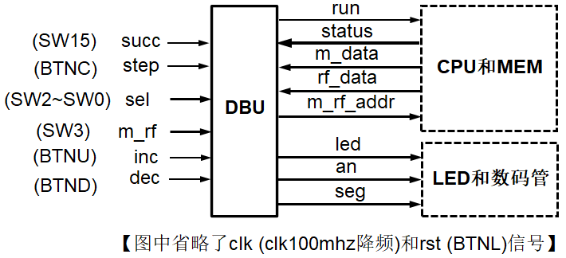

# 实验三 单周期CPU

## 1 实验目标

* 理解计算机硬件的基本组成、结构和工作原理。
* 掌握数字系统的设计和调试方法。
* 熟练掌握数据通路和控制器的设计和描述方法。

## 2 实验内容

### 2.1 单周期CPU


待设计的单周期CPU可以执行如下6条指令：

- **add**: rd \<- rs + rt; op = 000000, funct = 100000

    {width="5.09375in" height="0.3282250656167979in"}

- **addi**: rt \<- rs + imm; op = 001000

- **lw**: rt \<- M(rs + addr); op = 100011

- **sw**: M(rs + addr) \<- rt; op = 101011

- **beq**:

    ```verilog
    if (rs = rt) then pc <- pc + 4 + addr \<\< 2
    else pc <- pc + 4; op = 000100
    ```

{width="5.114583333333333in"
height="0.32169510061242346in"}

-   **j**: pc \<- (pc+4)\[31:28\] \| (add\<\<2)\[27:0\]; op = 000010

{width="5.114583333333333in"
height="0.3216940069991251in"}

待设计的CPU的逻辑符号如图-1所示，端口声明如下：


```verilog
module cpu_one_cycle //单周期CPU
(
    input clk, //时钟（上升沿有效）
    input rst //异步复位，高电平有效
);

    ......

endmodule
```

{width="1.1666666666666667in"
height="0.5938910761154855in"}
<center>图-1 CPU逻辑符号</center>

分析以上待实现指令的功能，设计CPU的数据通路和控制单元（橙色部分）如图-2所示，其中ALU和寄存器堆可以利用实验1和实验2设计的模块来实现，指令存储器ROM和数据存储器RAM均采用IP例化实现，容量为256 x 32位的分布式存储器。

{width="6.15625in" height="3.671894138232721in"}

<center>图-2 单周期CPU逻辑框图
</center>

### 2.2 调试单元（Debug Unit，DBU）


为了方便下载调试，设计一个调试单元DBU，该单元可以用于控制CPU的运行方式，显示运行过程的中间状态和最终运行结果。

DBU的端口与CPU以及FPGA开发板外设（拨动/按钮开关、LED指示灯、7-段数码管）的连接如图-3所示。为了DBU在不影响CPU运行的情况下，随时监视CPU运行过程中寄存器堆和数据存储器的内容，可以为寄存器堆和数据存储器增加1个用于调试的读端口。

{width="4.958333333333333in"
height="2.265488845144357in"}

<center>图-3 调试单元端口及其连接图
</center>
-   控制CPU运行方式


-   `succ = 1`: 控制CPU连续执行指令，run = 1（一直维持）

-   `succ = 0`: 控制CPU执行一条指令，每按动step一次，run输出维持一个时钟周期的脉冲


-   `sel = 0`: 查看CPU运行结果 (存储器或者寄存器堆内容)


-   `m_rf`： 1，查看存储器(MEM)；0，查看寄存器堆(RF)

-   `m_rf_addr`： MEM/RF的调试读口地址(字地址)，复位时为零

-   `inc/dec`：`m_rf_addr`加1或减1

-   `rf_data/m_data`：从RF/MEM读取的数据字

-   16个LED指示灯显示 `m_rf_addr`

-   8个数码管显示 `rf_data/m_data`


-   `sel = 1 \~ 7 ` ：查看CPU运行状态（status）


-   12个LED指示灯(SW11\~SW0)依次显示控制器的控制信号 `Jump, Branch, Reg\_Dst, RegWrite, MemRead, MemtoReg, MemWrite, ALUOp, ALUSrc, ALUZero`，其中ALUOp为3位。

-   8个数码管显示由sel选择的一个32位数据

-   `sel = 1`：`pc_in`, PC的输入数据

-   `sel = 2`：`pc_out`, PC的输出数据

-   `sel = 3`：`instr`, 指令存储器的输出数据

-   `sel = 4`：`rf_rd1`, 寄存器堆读口1的输出数据

-   `sel = 5`：`rf_rd2`, 寄存器堆读口2的输出数据

-   `sel = 6`：`alu_y`, ALU的运算结果

-   `sel = 7`：`m_rd`, 数据存储器的输出数据

## 3 实验步骤


### 3.1  结构化描述单周期CPU的数据通路和控制器，并进行功能仿真；


### 3.2  设计实现调试单元（DBU），并进行功能仿真；


### 3.3  将CPU和DBU下载至FPGA中测试：端口与FPGA开发板N4-DDR的外设的连接关参见图-3所示。


## 4 实验检查


### 4.1  检查单周期CPU的功能仿真；


### 4.2  检查调试单元DBU的功能仿真；


### 4.3  检查CPU和DBU下载至FPGA后的运行功能。


## 5 思考题

1. 修改数据通路和控制器，增加支持如下指令：

accm: rd \<- M(rs) + rt; op = 000000, funct = 101000

{width="5.083333333333333in"
height="0.3275535870516185in"}
