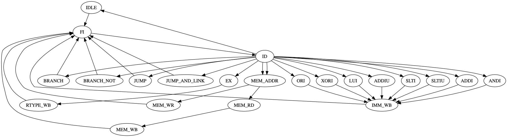
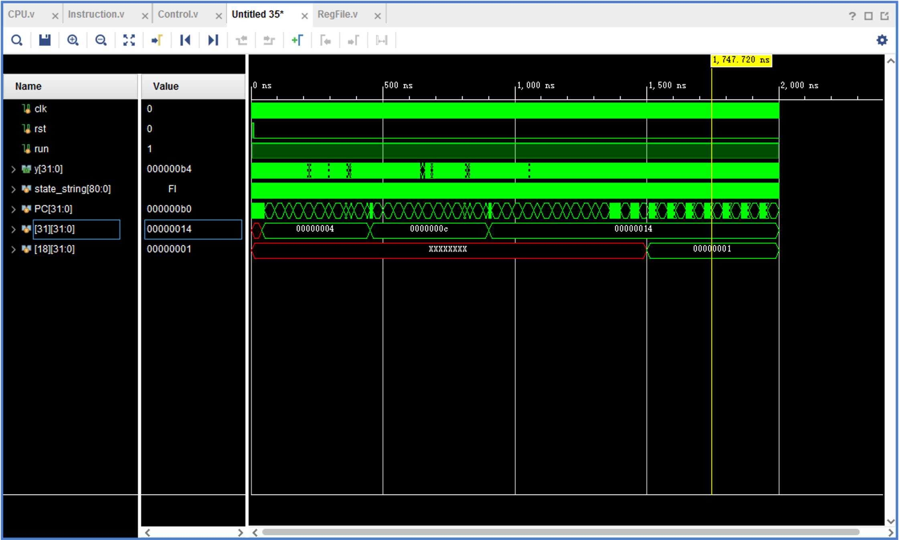
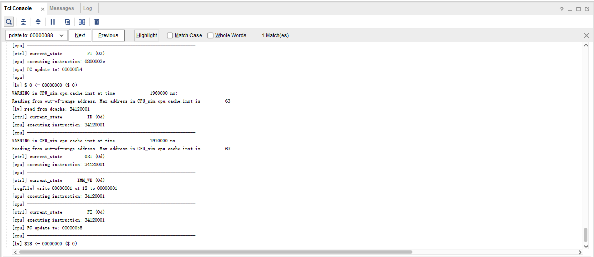

**《计算机组成原理实验》指导手册**

实验四 多周期CPU

## 1 实验目标

* 1.1  理解计算机硬件的基本组成、结构和工作原理；

* 1.2  掌握数字系统的设计和调试方法；

* 1.3  熟练掌握数据通路和控制器的设计和描述方法。

## 2 实验内容

### 2.1 多周期CPU


待设计的多周期CPU可以执行如下6条指令：

-   **add**: rd \<- rs + rt; op = 000000, funct = 100000

{width="5.09375in" height="0.3282250656167979in"}

-   **addi**: rt \<- rs + imm; op = 001000

> **lw**: rt \<- M(rs + addr); op = 100011
>
> **sw**: M(rs + addr) \<- rt; op = 101011
>
> **beq**: if (rs = rt) then pc \<- pc + 4 + addr \<\< 2
>
> else pc \<- pc + 4; op = 000100

{width="5.114583333333333in"
height="0.32169510061242346in"}

-   **j**: pc \<- (pc+4)\[31:28\] \| (add\<\<2)\[27:0\]; op = 000010

{width="5.114583333333333in"
height="0.3216940069991251in"}

待设计的CPU的逻辑符号如图-1所示，端口声明如下：

> module cpu\_one\_cycle //单周期CPU
>
> {width="1.1666666666666667in"
> height="0.5938910761154855in"}(input clk, //时钟（上升沿有效）
>
> input rst //异步复位，高电平有效
>
> );
>
> ......
>
> endmodule 图-1 CPU逻辑符号

满足上述指令的功能，设计多周期CPU的数据通路和控制器（橙色部分）如图-2所示，其中控制器的状态图如图-3所示。具体实现时ALU和寄存器堆可以利用实验1和实验2设计的模块，指令和数据存储共用一个RAM存储器，采用IP例化实现，容量为512
x 32位的分布式存储器。

{width="9.148303805774278in"
height="5.032271434820648in"}

<center>图-2 多周期CPU的数据通路和控制器
</center>
{width="0.7221828521434821in"
height="3.431558398950131in"}

{width="4.5147233158355204in"
height="2.3333333333333335in"}

{width="5.625in" height="5.806399825021872in"}

<center>图-3 多周期CPU控制器的状态图
</center>
### 2.2 调试单元（Debug Unit，DBU）


为了方便下载调试，设计一个调试单元DBU，该单元的功能和结构与实验三类似，可以用于控制CPU的运行方式，显示运行过程的中间状态和最终运行结果。DBU的端口与CPU以及FPGA开发板外设（拨动/按钮开关、LED指示灯、7-段数码管）的连接如图-4所示。为了DBU在不影响CPU运行的情况下，随时监视CPU运行过程中寄存器堆和数据存储器的内容，可以为寄存器堆和数据存储器增加1个用于调试的读端口。

{width="4.458333333333333in"
height="2.0883409886264217in"}

<center>图-4 调试单元端口及其连接图
</center>
-   控制CPU运行方式


-   succ =
    1：clkd输出连续的周期性脉冲信号，可以作为CPU的时钟信号，控制CPU连续执行指令

-   succ =
    0：每按动step一次，clkd输出一个脉冲信号，可以作为CPU的时钟信号，控制CPU执行一个时钟周期


-   sel = 0：查看CPU运行结果 (存储器或者寄存器堆内容)


-   m\_rf： 1，查看存储器(MEM)；0，查看寄存器堆(RF)

-   m\_rf\_addr： MEM/RF的调试读口地址(字地址)，复位时为零

-   inc/dec：m\_rf\_addr加1或减1

-   rf\_data/m\_data：从RF/MEM读取的数据字

-   16个LED指示灯显示m\_rf\_addr

-   8个数码管显示rf\_data/m\_data


-   sel = 1 \~ 7：查看CPU运行状态（status）


-   16个LED指示灯(SW15\~SW0)依次显示控制器的控制信号PCSource(2)、PCwe、IorD、MemWrite、IRWrite、RegDst、MemtoReg、RegWrite、ALUm(3)、ALUSrcA、ALUSrcB(2)
    和ALUZero

-   8个数码管显示由sel选择的一个32位数据

> sel = 1：PC，程序计数器
>
> sel = 2：IR，指令寄存器
>
> sel = 3：MD, 存储器读出数据寄存器
>
> sel = 4：A, 寄存器堆读出寄存器A
>
> sel = 5：B, 寄存器堆读出寄存器B
>
> sel = 6：ALUOut, ALU运算结果寄存器
>
> sel = 7：

## 3 实验步骤

### 3.1  单周期CPU的设计和仿真

#### 3.1.1 CPU 的指令集层设计

对MIPS中 `opcode` 和 `funct` 分别进行定义如下：

##### 指令 `opcode`

所有支持的 opcode 列举如下。（就是MIPS在没有协处理器情况下，所支持的全部`opcode`）

```verilog
// instrucitons:
// opcode rtype 
`define OPCODE_RTYPE 6'b000000
// opcode addi 
`define OPCODE_ADDI 6'b001000
// opcode addiu 
`define OPCODE_ADDIU 6'b001001
// opcode andi 
`define OPCODE_ANDI 6'b001100
// opcode ori 
`define OPCODE_ORI 6'b001101
// opcode xori 
`define OPCODE_XORI 6'b001110
// opcode lui 
`define OPCODE_LUI 6'b001111
// opcode slti 
`define OPCODE_SLTI 6'b001010
// opcode sltiu 
`define OPCODE_SLTIU 6'b001011
// opcode lw 
`define OPCODE_LW 6'b100011
// opcode sw 
`define OPCODE_SW 6'b101011
// opcode beq 
`define OPCODE_BEQ 6'b000100
// opcode bne 
`define OPCODE_BNE 6'b000101
// opcode j 
`define OPCODE_J 6'b000010
// opcode jal 
`define OPCODE_JAL 6'b000011
```

##### rtype指令 `funct`

所有支持的 `funct` 列举如下。（就是MIPS在没有协处理器情况下，所支持的全部`funct`）

```verilog
// Functs:
// funct add(6'b100000) 
`define FUNCT_ADD 6'b100000
// funct addu(6'b100001) 
`define FUNCT_ADDU 6'b100001
// funct sub(6'b100010) 
`define FUNCT_SUB 6'b100010
// funct subu(6'b100011) 
`define FUNCT_SUBU 6'b100011
// funct and(6'b100100) 
`define FUNCT_AND 6'b100100
// funct or(6'b100101) 
`define FUNCT_OR 6'b100101
// funct xor(6'b100110) 
`define FUNCT_XOR 6'b100110
// funct nor(6'b100111) 
`define FUNCT_NOR 6'b100111
// funct sllv(6'b000100) 
`define FUNCT_SLLV 6'b000100
// funct srlv(6'b000110) 
`define FUNCT_SRLV 6'b000110
// funct srav(6'b000111) 
`define FUNCT_SRAV 6'b000111
// funct sll(6'b000000) 
`define FUNCT_SLL 6'b000000
// funct srl(6'b000010) 
`define FUNCT_SRL 6'b000010
// funct sra(6'b000011) 
`define FUNCT_SRA 6'b000011
// funct sra(6'b000011) 
`define FUNCT_SRA 6'b000011
// funct slt(6'b101010) 
`define FUNCT_SLT 6'b101010
// funct sltu(6'b101011) 
`define FUNCT_SLTU 6'b101011
// funct jr(6'b001000) 
`define FUNCT_JR 6'b001000
```

##### 控制单元 Signal 

控制单元 Signal 的定义如下：（与讲义定义名称相同，这里统一了变量书写形式（小写蛇形），当然也添加了很多）

```verilog
// Signal's structure
// -  pc_write (1) 
// -  pc_write_cond (1) 
// -  pc_write_notcond (1) : 为 bne 提供的选择器
// -  pc_source (2) 
`define PCSource_NPC 2'd0
`define PCSource_Beq 2'd1
`define PCSource_Jump 2'd2
// -  i_or_d (1) : memory 入口选择器
`define MemAddr_I 1'b1
`define MemAddr_D 1'b0
// -  mem_write (1) 
// -  mem_read (1) : 写入 mdr
// -  ir_write (1) 
// -  mem_toreg (2) : refile写入数据的mux
`define MemToReg_Mem 2'd1
`define MemToReg_ALU 2'd0
`define MemToReg_PC 2'd2 // 为 jal 设计，设为PC，可以参考后面的代码
// -  reg_write (1) 
// -  reg_dst (2) 
`define RegDst_Rd 2'd1
`define RegDst_Rt 2'd0
`define RegDst_RA 2'd2 // 为 jal 设计，设为 5‘d32，可以参考后面的代码
// -  aluop (3) : 传入ALU_Control
`define ALUOp_CMD_RTYPE 3'd0
`define ALUOp_CMD_ADD 3'd1
`define ALUOp_CMD_SUB 3'd2
`define ALUOp_CMD_AND 3'd3
`define ALUOp_CMD_OR 3'd4
`define ALUOp_CMD_XOR 3'd5
`define ALUOp_CMD_NOR 3'd6
`define ALUOp_CMD_LU 3'd7
// -  alu_out_mux (2) : alu出口处的mux
`define ALUOut_Orig  3'd0
`define ALUOut_LT 3'd1
`define ALUOut_LTU 3'd2
// -  alu_src2 (3) 
`define ALUSrc2_Reg 3'd0
`define ALUSrc2_4 3'd1
`define ALUSrc2_SImm 3'd2
`define ALUSrc2_SAddr 3'd3
`define ALUSrc2_UImm 3'd4 // 为 addi 设计，可以参考后面的代码
// -  alu_src1 (1) 
`define ALUSrc1_PC 2'd0
`define ALUSrc1_OprA 2'd1
```

##### ALU控制单元 Signal

 我这里 ALU 控制单元负责所有的 funct 译码，控制单元只对opcode译码，不对 funct 译码。这样设计主要是为了减少控制单元译码的工作量，而ALU控制单元的译码工作量并没有显著增加。

 为了实现一些比较特殊的 rtype 指令，ALU控制单元也会有一些 [SIGNAL_W-1:0] 信号，具体列举如下：
```verilog
// ALUSignal's structure
// -  alu_m (4) : ALU 操作
`define ALU_ADD  4'd0
`define ALU_SUB  4'd1
`define ALU_AND  4'd2
`define ALU_OR  4'd3
`define ALU_XOR  4'd4
`define ALU_NOR  4'd5
`define ALU_SHL  4'd6
`define ALU_SHRL  4'd7
`define ALU_SHRA  4'd8
`define ALU_LU  4'd9
// -  alu_src1 (1) : ALU控制模块能够对 ALU 的第一个选择器做出控制。
`define ALUSrc1_Orig  3'd0
`define ALUSrc1_Shamt 3'd1 // 为 sll 指令设计
// -  alu_out_mux (2) : 和上面的控制模块的alu_out_mux相同，ALU控制模块会综合 funct 和控制模块的 alu_out_mux 生成这个 alu_out_mux。
// -  is_jr_funct (1) : 为 jr 特别设计的Signal
```

#### 3.1.2 CPU的设计

##### 数据通路设计

 CPU设计的代码和思路具体见（https://github.com/DnailZ/COLabs/blob/master/lab4/src/verilog/logic/CPU.v）
```verilog
module CPU
#(
    parameter STATUS_W = 247,
    parameter SIGNAL_W = 23,
    parameter REG_W = 5,
    parameter WIDTH = 32,
    parameter FUNCT_W = 6,
    parameter OPCODE_W = 6,
    parameter ALUOP_W = 4
) (
    input  clk, 
    input  rst, 
    input  run, 
    input [7:0] m_rf_addr, 
    output [STATUS_W-1:0] status, 
    output [WIDTH-1:0] m_data, 
    output [WIDTH-1:0] rf_data 
);
    wire [SIGNAL_W-1:0] sgn; // sgn 表示 signal
    // 控制单元
    Control ctrl (
        .clk(clk), // 控制单元需要时钟同步来输出 TCL Console 中的文本调试信息。
        .rst(rst),
        .run(run),
    	.opcode(instruction [31:26] ),
    	.sgn(sgn)
    );
    // 拆开 sgn
    wire sgn_pc_write;
    wire sgn_pc_write_cond;
    wire sgn_pc_write_notcond;
    wire [1:0] sgn_pc_source;
    wire sgn_i_or_d;
    wire sgn_mem_write;
    wire sgn_mem_read;
    wire sgn_ir_write;
    wire [1:0] sgn_mem_toreg;
    wire sgn_reg_write;
    wire [1:0] sgn_reg_dst;
    wire [2:0] sgn_aluop;
    wire [1:0] sgn_alu_out_mux;
    wire [2:0] sgn_alu_src2;
    wire sgn_alu_src1;
    assign { sgn_pc_write, sgn_pc_write_cond, sgn_pc_write_notcond, sgn_pc_source, sgn_i_or_d, sgn_mem_write, sgn_mem_read, sgn_ir_write, sgn_mem_toreg, sgn_reg_write, sgn_reg_dst, sgn_aluop, sgn_alu_out_mux, sgn_alu_src2, sgn_alu_src1} = sgn;

    // 下将 CPU 分为五个阶段分别编写，会在下面的章节逐个展开
     ......
endmodule
```

 ##### FI 段

 FI 段，编写 PC 和 mdr / ir。

```verilog
    // -----------------------------------
    // FETCH INSTRUCTION
    // -----------------------------------
    reg [WIDTH-1:0] PC;
    reg [WIDTH-1:0] operandA, operandB;
    reg [WIDTH-1:0] alu_out;

    wire mem_write = sgn_mem_write & run;
    wire [WIDTH-1:0] mem_rd;
    // 内存地址选择器 IorD
    wire [WIDTH-1:0] mem_addr = (sgn_i_or_d == `MemAddr_I)? PC : alu_out;
    
    dist_mem_gen_0 cache(
        .clk(clk),
        .a(mem_addr[9:2]),
        .d(operandB),
        .we(mem_write),
        .spo(mem_rd),
        .dpra(m_rf_addr),
        .dpo(m_data)
    );
    reg [WIDTH-1:0] mdr;
    reg [WIDTH-1:0] instruction;
    always @(posedge clk) begin
        if(rst) begin
            mdr <= 0; instruction <= 0;
        end else begin
            // 这里 sgn_mem_read 用于写入 mdr， sgn_ir_write 用于写入 ir
            if(run && sgn_mem_read) begin
                mdr <= mem_rd;
            end
            if(run && sgn_ir_write) begin
                instruction <= mem_rd;
            end
        end
    end

    // next_PC 和 PCwe 提供给后面使用
    reg [WIDTH-1:0] next_PC;
    wire PCwe;
    always@(posedge clk or posedge rst) begin
        if(rst)
            PC <= 0;
        else if(run & PCwe)
            PC <= next_PC;
    end

```

 ##### ID 段

 ID 段，编写寄存器文件。

 除此之外，ID 段还应该完成立即数的符号扩展。（在这里保持良好的可扩展性，添加了无符号扩展，可以对 `andi`, `ori` 等指令提供支持）

 注：这里用 `sgn` 表示 CPU 的控制信号
```verilog
    // -----------------------------------
    // DECODE INSTRUCTION
    // -----------------------------------

    wire [WIDTH-1:0] regfile_rd0;
    wire [WIDTH-1:0] regfile_rd1;
    wire [REG_W-1:0] regfile_wa;
    wire  regfile_we;
    wire [WIDTH-1:0] regfile_wd;
    
    RegFile regfile (
    	.clk(clk),
    	.rst(rst),
    	.m_rf_addr(m_rf_addr),
    	.rf_data(rf_data),
    	.ra0(instruction [25:21] ),
    	.ra1(instruction [20:16] ),
    	.rd0(regfile_rd0),
    	.rd1(regfile_rd1),
    	.wa(regfile_wa),
    	.we(regfile_we),
    	.wd(regfile_wd)
    );
    always @(posedge clk) begin
        if(rst) begin
            {operandA, operandB} <= 0;
        end
        else if(run) begin
            operandA <= regfile_rd0;
            operandB <= regfile_rd1;
        end
    end

    wire [15:0] Imm = instruction [15:0] ;
    wire [WIDTH-1:0] signed_Imm = {{16{Imm[15]}}, Imm};                       // 为 addi addiu 等提供支持
    wire [WIDTH-1:0] signed_shifted_Imm = signed_Imm << 2;                    // 可以为 beq 指令提供支持
    wire [WIDTH-1:0] unsigned_Imm = {16'b0, Imm};                             // 无符号数扩展，可以对 `andi`, `ori` 等指令提供支持
    wire [WIDTH-1:0] imm_addr = {PC[31:28] , instruction [25:0] , 2'b0};      // 为 jump 提供支持

```

 ##### EX 段
 EX 段，编写 ALU 以及其控制模块，

 ALU 控制模块将会将 `funct` 和控制模块的 `aluop` 转化为 ALU 的 `alu_m`。

 这里 ALUSrc1 的输入选择器有两个：

 - 一个是从控制模块 `Control` 发送来的，可以选择PC，为地址更新和计算提供支持。
 - 另一个从ALU控制模块发送过来的，可以选择 `instruction[Shamt]` ，为位移操作指令提供支持。（我把所以funct的译码全部放在aluctrl中，方便管理）

 除此之外，ALU的出口出还有一个选择器，用于选择输出的结果还是比较判断的结果，为 `slt` 指令提供支持。

```verilog
    // -----------------------------------
    // EXECUTE INSTRUCTION
    // -----------------------------------

    wire [ALUOP_W-1:0] aluctrl_alu_m;
    wire  aluctrl_alu_src1;
    wire [1:0] aluctrl_alu_out_mux;
    wire  aluctrl_is_jr_funct;
    // ALU控制单元（https://github.com/DnailZ/COLabs/blob/master/lab4/src/verilog/logic/CPU.v）
    ALU_control aluctrl (
    	.sgn_alu_out_mux(sgn_alu_out_mux),
    	.aluop(sgn_aluop),
    	.funct(instruction [5:0] ),
    	.alu_m(aluctrl_alu_m),
    	.alu_src1(aluctrl_alu_src1),
    	.alu_out_mux(aluctrl_alu_out_mux),
    	.is_jr_funct(aluctrl_is_jr_funct)
    );

    // ALUSrc1 的两个选择器。
    // 从控制模块 `Control` 发送来的，可以选择PC，为地址更新和计算提供支持。
    wire [WIDTH-1:0] alu_a_orig = sgn_alu_src1 == `ALUSrc1_OprA ? operandA : PC;
    // 从ALU控制模块发送过来的，可以选择 `instruction[Shamt]` ，为位移操作指令提供支持。
    wire [WIDTH-1:0] alu_a = aluctrl_alu_src1 == `ALUSrc1_Orig ? alu_a_orig : instruction [10:6] ;

    // ALUSrc2 的选择器，增加来无符号扩展，为 `andi` 等指令提供支持。
    reg [WIDTH-1:0] alu_b;
    always @(*) begin
        alu_b = 0;
        case(sgn_alu_src2)
        `ALUSrc2_Reg: alu_b = operandB;
        `ALUSrc2_4:    alu_b = 4;
        `ALUSrc2_SAddr: alu_b = signed_shifted_Imm;
        `ALUSrc2_SImm: alu_b = signed_Imm;
        `ALUSrc2_UImm: alu_b = unsigned_Imm;
        default: alu_b = 0;
        endcase
    end

    // 例化一个ALU
    wire [WIDTH-1:0] alu_y;
    wire  alu_zf;
    wire  alu_cf;
    wire  alu_of;
    
    ALU alu (
    	.a(alu_a),
    	.b(alu_b),
    	.m(aluctrl_alu_m),
    	.y(alu_y),
    	.zf(alu_zf),
    	.cf(alu_cf),
    	.of(alu_of)
    );

    // ALUOut 选择器，为 `slt` 指令提供支持。
    always @(posedge clk) begin
        if(rst)
            alu_out <= 0;
        else if (run) begin
            case(aluctrl_alu_out_mux)
            `ALUOut_Orig: alu_out <= alu_y;  
            `ALUOut_LT: alu_out <= alu_y[WIDTH-1];
            `ALUOut_LTU: alu_out <= alu_cf; // 无符号数比较
            default: alu_out <= alu_y;
            endcase
        end
    end

```

 ##### MEM 段

 Memory已经在FI段编写了，这里只需要更新PC

 对于 jr 指令，需要在原有的 `pc_source` 选择器之外另加一个选择器。（由于我把funct的译码全部放在aluctrl里面，这样实现最为方便）
```verilog
    // -----------------------------------
    // MEMORY
    // -----------------------------------

    wire [WIDTH-1:0] nPC = alu_y;
    always @(*) begin
        next_PC = 0;
        // PC_Srouce 选择器
        case(sgn_pc_source)
        `PCSource_NPC: next_PC = nPC;
        `PCSource_Beq: next_PC = alu_out;
        `PCSource_Jump: next_PC = imm_addr;
        default: next_PC = 0;
        endcase
        // jr指令的特殊处理
        if(aluctrl_is_jr_funct)
            next_PC = operandA;
    end
    // jr 的优先级最高
    assign PCwe = aluctrl_is_jr_funct || sgn_pc_write || sgn_pc_write_cond && alu_zf || sgn_pc_write_notcond && ~alu_zf;

```

 ##### WB 段

 WB 段，regfile 写入的内容。
 
 RegDst_RA 和 MemToReg_PC 这两项用于简单地提供对 `jal` 指令对 $ra 的保存。
```verilog
    // -----------------------------------
    // WRITEBACK
    // -----------------------------------

    assign regfile_wa = (sgn_reg_dst == `RegDst_Rt)? instruction [20:16] :
                        (sgn_reg_dst == `RegDst_Rd)? instruction [15:11] :
                        (sgn_reg_dst == `RegDst_RA)? 5'b11111 : 0; // jal 指令
    assign regfile_we = sgn_reg_write;
    assign regfile_wd = (sgn_mem_toreg == `MemToReg_Mem)? mdr :
                        (sgn_mem_toreg == `MemToReg_ALU)? alu_out :
                        (sgn_mem_toreg == `MemToReg_PC)? PC : 0; // jal 指令

```

 ##### Debug 信息

 DBU 所需要的 status 和指令信息。**仿真时输出，不会影响综合效果**
```verilog
    // -----------------------------------
    // DEBUG MESSAGE （仿真时输出，不会影响综合效果）
    // -----------------------------------

    assign status = {      //
        sgn,               // signal
        next_PC,           // next_pc
        PC,                // pc
        instruction,       // instruction
        operandA,          // regfile_rd0
        operandB,          // regfile_rd1
        alu_out,           // alu_out
        mdr                // mem_rd
    };                     //

    // （仿真时输出，不会影响综合效果）
    `ifndef SYSTHESIS
    always @(posedge clk) begin
        if(~rst & run) begin
            $display("[cpu] executing instruction: %h", instruction);
            if(PCwe) $display("[cpu] PC update to: %h", next_PC);
            $display("[cpu] ------------------------------------------------------------------- ");
        end
    end
    always @(posedge clk) begin
        if(~rst & run) begin
            if(sgn_mem_read) begin
                $display("[lw] $%d <- %h ($%d)", instruction [20:16] , alu_out, instruction [25:21] );
                #1 $display("[lw] read from dcache: %h", mdr);
            end
        end
    end
    always @(posedge clk) begin
        if(~rst & run) begin
            if(sgn_mem_write) begin
                $display("[sw] $%d (%d) -> %h", instruction [20:16], operandA, alu_out);
                #1 $display("[sw] write to dcache: %h", operandB);
            end
        end
    end
    always @(posedge clk) begin
        if(~rst & run) begin
            if(sgn_pc_write_cond) begin
                $display("[beq] signed_Imm:", signed_Imm);
                $display("[beq] alu_zf: %d PC move to %h", alu_zf, next_PC);
            end
        end
    end
    `endif
```

 ##### 控制单元

 控制单元的状态机大体如下

 

 完整代码参考：（https://github.com/DnailZ/COLabs/blob/master/lab4/src/verilog/logic/Control.v）

```verilog
module Control
#(
     ......
) (
    input  clk, 
    input  rst, 
    input  run, 
    input [5:0] opcode, 
    output [SIGNAL_W-1:0] sgn // signals
);
    // -----------------------------------
    // State Definition
    // -----------------------------------
    localparam STATE_W = 5;
    localparam STATE_IDLE = 5'd0;
    localparam STATE_FI = 5'd1;
    localparam STATE_ID = 5'd2;
    localparam STATE_EX = 5'd3;
    localparam STATE_RTYPE_WB = 5'd4;
    localparam STATE_MEM_ADDR = 5'd5;
    localparam STATE_MEM_RD = 5'd6;
    localparam STATE_MEM_WR = 5'd7;
    localparam STATE_MEM_WB = 5'd8;
    localparam STATE_BRANCH = 5'd9;
    localparam STATE_BRANCH_NOT = 5'd10;
    localparam STATE_JUMP = 5'd11;
    localparam STATE_JUMP_AND_LINK = 5'd12;
    localparam STATE_ADDI = 5'd13;
    localparam STATE_ADDIU = 5'd14;
    localparam STATE_ANDI = 5'd15;
    localparam STATE_ORI = 5'd16;
    localparam STATE_XORI = 5'd17;
    localparam STATE_LUI = 5'd18;
    localparam STATE_SLTI = 5'd19;
    localparam STATE_SLTIU = 5'd20;
    localparam STATE_IMM_WB = 5'd21;

    reg [STATE_W-1:0] current, next;
    // -----------------------------------
    // Signal's Logic
    // -----------------------------------
    reg sgn_pc_write;
    reg sgn_pc_write_cond;
    reg sgn_pc_write_notcond;
    reg [1:0] sgn_pc_source;
    reg sgn_i_or_d;
    reg sgn_mem_write;
    reg sgn_mem_read;
    reg sgn_ir_write;
    reg [1:0] sgn_mem_toreg;
    reg sgn_reg_write;
    reg [1:0] sgn_reg_dst;
    reg [2:0] sgn_aluop;
    reg [1:0] sgn_alu_out_mux;
    reg [2:0] sgn_alu_src2;
    reg sgn_alu_src1;
    assign sgn = { sgn_pc_write, sgn_pc_write_cond, sgn_pc_write_notcond, sgn_pc_source, sgn_i_or_d, sgn_mem_write, sgn_mem_read, sgn_ir_write, sgn_mem_toreg, sgn_reg_write, sgn_reg_dst, sgn_aluop, sgn_alu_out_mux, sgn_alu_src2, sgn_alu_src1};

    // 生成Signal的全部组合逻辑
    always @(*) begin
        begin                                 //
            sgn_pc_write = 1'b0;              // pc_write (by default)
            sgn_pc_write_cond = 1'b0;         // pc_write_cond (by default)
            sgn_pc_write_notcond = 1'b0;      // pc_write_notcond (by default)
            sgn_pc_source = 2'bxx;            // pc_source (by default)
            sgn_i_or_d = 1'bx;                // i_or_d (by default)
            sgn_mem_write = 1'b0;             // mem_write (by default)
            sgn_mem_read = 1'bx;              // mem_read (by default)
            sgn_ir_write = 1'b0;              // ir_write (by default)
            sgn_mem_toreg = 2'bxx;            // mem_toreg (by default)
            sgn_reg_write = 1'b0;             // reg_write (by default)
            sgn_reg_dst = 2'bxx;              // reg_dst (by default)
            sgn_aluop = 3'bxxx;               // aluop (by default)
            sgn_alu_out_mux = 2'b00;          // alu_out_mux (by default)
            sgn_alu_src2 = 3'bxxx;            // alu_src2 (by default)
            sgn_alu_src1 = 1'bx;              // alu_src1 (by default)
        end                                   //
        case(current)
        // -----------------------------------
        // Basic States
        // -----------------------------------
        STATE_IDLE:
            next = STATE_FI;
        STATE_FI: begin
            sgn_i_or_d = `MemAddr_I;
            sgn_ir_write = 1;
            sgn_mem_read = 1;
            sgn_aluop = `ALUOp_CMD_ADD;
            sgn_alu_src2 = `ALUSrc2_4;
            sgn_alu_src1 = `ALUSrc1_PC;
            sgn_pc_write = 1;
            sgn_pc_source = `PCSource_NPC;
            next = STATE_ID;
        end
        STATE_ID: begin
            sgn_aluop = `ALUOp_CMD_ADD;
            sgn_alu_src2 = `ALUSrc2_SAddr;
            sgn_alu_src1 = `ALUSrc1_PC;
            case(opcode)
            `OPCODE_RTYPE: 
                next = STATE_EX;
            // 这里省略其他的 opcode 定义
             ......
            default:
                next = STATE_IDLE;
            endcase
        end
        // -----------------------------------
        // RTYPE 
        // -----------------------------------
        STATE_EX: begin
            sgn_aluop = `ALUOp_CMD_RTYPE;
            sgn_alu_src2 = `ALUSrc2_Reg;
            sgn_alu_src1 = `ALUSrc1_OprA;
            next = STATE_RTYPE_WB;
        end
        STATE_RTYPE_WB: begin
            sgn_reg_write = 1;
            sgn_reg_dst = `RegDst_Rd;
            sgn_mem_toreg = `MemToReg_ALU;
            next = STATE_FI;
        end
        // -----------------------------------
        // LW and SW
        // -----------------------------------
        STATE_MEM_ADDR: begin
            sgn_aluop = `ALUOp_CMD_ADD;
            sgn_alu_src2 = `ALUSrc2_SImm;
            sgn_alu_src1 = `ALUSrc1_OprA;
            if(opcode == `OPCODE_LW) begin
                next = STATE_MEM_RD;
            end else begin
                next = STATE_MEM_WR;
            end
        end
        STATE_MEM_RD: begin
            sgn_i_or_d = `MemAddr_D;
            sgn_mem_read = 1;
            next = STATE_MEM_WB;
        end
        STATE_MEM_WR: begin
            sgn_i_or_d = `MemAddr_D;
            sgn_mem_write = 1;
            next = STATE_FI;
        end
        STATE_MEM_WB: begin
            sgn_reg_write = 1;
            sgn_reg_dst = `RegDst_Rt;
            sgn_mem_toreg = `MemToReg_Mem;
            next = STATE_FI;
        end
        // 其他还有 Branch、Jump指令，这里全都省略（完整版参考https://github.com/DnailZ/COLabs/blob/master/lab4/src/verilog/logic/Control.v）
         ......
        default:;
        endcase
    end

    // current
    always @(posedge clk or negedge rst) begin
        if(rst) begin
            current = STATE_IDLE;
        end else if(run) begin
            current = next;
        end
    end


    // -----------------------------------
    // Debug Message（仿真时输出，不会影响综合效果）
    // -----------------------------------

    reg [10*8:0] state_string;
    always @(*) begin
        case(current)
        STATE_IDLE: state_string = "IDLE";
        STATE_FI: state_string = "FI";
        STATE_ID: state_string = "ID";
        STATE_EX: state_string = "EX";
             ......
        endcase
    end

    // （仿真时输出，不会影响综合效果）
    `ifndef SYSTHESIS
    always @(posedge clk) begin
        if(~rst & run) begin
            $display("[ctrl] current_state %s (%h)", state_string, opcode);
        end
    end
    `endif
    
endmodule
```

##### ALU 控制单元

由于这里的实现和单周期的一样，受限于篇幅，代码在此省略，可以参考：

https://github.com/DnailZ/COLabs/blob/master/lab4/src/verilog/logic/ALU_control.v

### 3.1.3 对助教的代码进行仿真测试

编写仿真代码：

```verilog
module CPU_sim
#(
    parameter STATUS_W = 247,
    parameter SIGNAL_W = 23,
    parameter REG_W = 5,
    parameter WIDTH = 32,
    parameter FUNCT_W = 6,
    parameter OPCODE_W = 6,
    parameter ALUOP_W = 4
)();
    reg clk, rst;
    reg run;
    
    initial begin
        rst = 1;
        #10 rst = 0;
    end
    
    initial clk = 1;
    always #5 clk = ~clk;
    
    initial  run = 1;
    wire [WIDTH-1:0] mem_rd_addr = 8;
    wire [STATUS_W-1:0] cpu_status;
    wire [WIDTH-1:0] cpu_m_data;
    wire [WIDTH-1:0] cpu_rf_data;
    
    CPU cpu (
    	.clk(clk),
    	.rst(rst),
    	.run(run),
    	.m_rf_addr(mem_rd_addr[9:2]),
    	.status(cpu_status),
    	.m_data(cpu_m_data),
    	.rf_data(cpu_rf_data)
    );

endmodule
```

得到仿真结果：代码大概在 PC=0x78 时变为 1，此时从CPU的状态可以看出正在执行 `sw` 指令。


从文本输出中可以看到 sw 将 $10 的数据写入内存中 8 处，测试成功。

### 3.2  将CPU和DBU下载至FPGA中测试


## 5 思考题

> 1. 修改数据通路和控制器，扩展对其他MIPS指令的支持，并进行功能仿真和下载测试。

### 5.1.1 较完整 MIPS 指令集 的 CPU 设计

之前的整个CPU的代码支持基本完整的 MIPS 指令集（不包括协处理器、陷入指令），可以具体设计可以参考前面的代码，这里摘录了一些相关内容。

##### 控制单元设计

增加大多数指令所需要的状态。


##### 位移指令的实现

在ALU增加对相关功能的支持

```verilog
    always @(*) begin
        {y, zf, cf, of} = 0;
        case(m)
            ......
            `ALU_SHL: y = b << a;
            `ALU_SHRL: y = b >> a;
            `ALU_SHRA: y = $unsigned($signed(b) >>> a);
            ......
            default: ;
        endcase
    end
```

在 ALUControl 单元中实现相关的 Funct：

```verilog
                `FUNCT_SLLV: begin            //
                    alu_m = `ALU_SHL;         // alu_m
                    alu_src1 = 1'b0;          // alu_src1 (by default)
                    alu_out_mux = 2'b00;      // alu_out_mux (by default)
                    is_jr_funct = 1'b0;       // is_jr_funct (by default)
                end                           //
                `FUNCT_SRLV: begin            //
                    alu_m = `ALU_SHRL;        // alu_m
                    alu_src1 = 1'b0;          // alu_src1 (by default)
                    alu_out_mux = 2'b00;      // alu_out_mux (by default)
                    is_jr_funct = 1'b0;       // is_jr_funct (by default)
                end                           //
                `FUNCT_SRAV: begin            //
                    alu_m = `ALU_SHRA;        // alu_m
                    alu_src1 = 1'b0;          // alu_src1 (by default)
                    alu_out_mux = 2'b00;      // alu_out_mux (by default)
                    is_jr_funct = 1'b0;       // is_jr_funct (by default)
                end                           //
                `FUNCT_SLL: begin                   //
                    alu_m = `ALU_SHL;               // alu_m
                    alu_src1 = `ALUSrc1_Shamt;      // alu_src1
                    alu_out_mux = 2'b00;            // alu_out_mux (by default)
                    is_jr_funct = 1'b0;             // is_jr_funct (by default)
                end                                 //
                `FUNCT_SRL: begin                   //
                    alu_m = `ALU_SHRL;              // alu_m
                    alu_src1 = `ALUSrc1_Shamt;      // alu_src1
                    alu_out_mux = 2'b00;            // alu_out_mux (by default)
                    is_jr_funct = 1'b0;             // is_jr_funct (by default)
                end                                 //
                `FUNCT_SRA: begin                   //
                    alu_m = `ALU_SHRA;              // alu_m
                    alu_src1 = `ALUSrc1_Shamt;      // alu_src1
                    alu_out_mux = 2'b00;            // alu_out_mux (by default)
                    is_jr_funct = 1'b0;             // is_jr_funct (by default)
                end                                 //
```

数据通路上增加一个选择器：

```verilog
	// 从ALU控制模块发送过来的，可以选择 `instruction[Shamt]` ，为位移操作指令提供支持。
    wire Word alu_a = aluctrl_alu_src1 == `ALUSrc1_Orig ? alu_a_orig : instruction [Shamt] ;
```

##### Jal 指令的实现

在 Jump 指令的基础上，增加保存 $ra 即可。

数据通路增加选择器：

```verilog
	assign regfile_wa = (sgn_reg_dst == `RegDst_Rt)? instruction [Rt] :
                        (sgn_reg_dst == `RegDst_Rd)? instruction [Rd] :
                        (sgn_reg_dst == `RegDst_RA)? 5'b11111 : 0; // jal 指令
    assign regfile_we = sgn_reg_write;
    assign regfile_wd = (sgn_mem_toreg == `MemToReg_Mem)? mdr :
                        (sgn_mem_toreg == `MemToReg_ALU)? alu_out :
                        (sgn_mem_toreg == `MemToReg_PC)? PC : 0; // jal 指令
```

控制单元增加状态：

```verilog
       STATE_JUMP_AND_LINK: begin
            sgn_pc_write = 1;
            sgn_pc_source = `PCSource_Jump;
            sgn_reg_write = 1;
            sgn_reg_dst = `RegDst_RA;
            sgn_mem_toreg = `MemToReg_PC;
            next = STATE_FI;
        end
```

##### 比较指令的实现

增加选择器。

```verilog
// ALUOut 选择器，为 `slt` 指令提供支持。
    always @(posedge clk) begin
        if(rst)
            alu_out <= 0;
        else if (run) begin
            case(aluctrl_alu_out_mux)
            `ALUOut_Orig: alu_out <= alu_y;  
            `ALUOut_LT: alu_out <= alu_y[WIDTH-1];
            `ALUOut_LTU: alu_out <= alu_cf; // 无符号数比较
            default: alu_out <= alu_y;
            endcase
        end
    end
```

增加状态：

```verilog
        STATE_SLTI: begin
            sgn_aluop = `ALUOp_CMD_SUB;
            sgn_alu_src2 = `ALUSrc2_SImm;
            sgn_alu_src1 = `ALUSrc1_OprA;
            sgn_alu_out_mux = `ALUOut_LT;
            next = STATE_IMM_WB;
        end
        STATE_SLTIU: begin
            sgn_aluop = `ALUOp_CMD_SUB;
            sgn_alu_src2 = `ALUSrc2_SImm;
            sgn_alu_src1 = `ALUSrc1_OprA;
            sgn_alu_out_mux = `ALUOut_LTU;
            next = STATE_IMM_WB;
        end
```

增加 funct

```verilog
                `FUNCT_SLT: begin                  //
                    alu_m = `ALU_SUB;              // alu_m
                    alu_src1 = 1'b0;               // alu_src1 (by default)
                    alu_out_mux = `ALUOut_LT;      // alu_out_mux
                    is_jr_funct = 1'b0;            // is_jr_funct (by default)
                end                                //
                `FUNCT_SLTU: begin                  //
                    alu_m = `ALU_SUB;               // alu_m
                    alu_src1 = 1'b0;                // alu_src1 (by default)
                    alu_out_mux = `ALUOut_LTU;      // alu_out_mux
                    is_jr_funct = 1'b0;             // is_jr_funct (by default)
                end               
```

##### jr 指令的实现

增肌funct：

```verilog
                `FUNCT_JR: begin              //
                    alu_m = `ALU_SUB;         // alu_m
                    alu_src1 = 1'b0;          // alu_src1 (by default)
                    alu_out_mux = 2'b00;      // alu_out_mux (by default)
                    is_jr_funct = 1'h1;       // is_jr_funct
                end                           //
```

更新PC：

```verilog
    always @(*) begin
        next_PC = 0;
        // PC_Srouce 选择器
        case(sgn_pc_source)
        `PCSource_NPC: next_PC = nPC;
        ......
        default: next_PC = 0;
        endcase
        // jr指令的特殊处理
        if(aluctrl_is_jr_funct)
            next_PC = operandA;
    end
    // jr 的优先级最高
    assign PCwe = aluctrl_is_jr_funct || sgn_pc_write || sgn_pc_write_cond && alu_zf || sgn_pc_write_notcond && ~alu_zf;

```

#### 5.1.2 功能仿真

采用armips汇编，armips会检查延迟槽，故添加一些 `nop` 命令。测试成功时标志是 `$s2 == 1` 失败时会有 `$s1 == -1`。

```asm
.ps2
.create "output.bin",0

start:
        jal test_sll :: nop
        jal test_sra :: nop
        jal test_slt :: nop
        j success :: nop

test_sll:
        li $t0, 0x10000000
        sll $s0, $t0, 3
        beq $s0, $0, fail :: nop
        
        li $t2, 4
        sllv $s0, $t0, $t2
        bne $s0, $0, fail :: nop
        jr $ra

test_sra:
        li $t1, 0xFFFFFFF0
        li $t2, 3
        li $t3, -1
        srav $s0, $t1, $t2
        beq $s0, $t3, fail :: nop
        
        sra $s0, $t1, 4
        bne $s0, $t3, fail :: nop
        jr $ra

test_slt:
        li $t0, -4
        li $t1, -3
        bgt $t0, -1, fail :: nop
        blt $t0, -5, fail :: nop

        slt $s0, $t1, $t0
        bne $s0, $0, fail :: nop
        jr $ra :: nop
        
fail:  
        li $s2, -1
        j fail :: nop

success:
        li $s2, 1
        j success :: nop

.close
```

汇编成二进制，读入 dist_mem_gen 里面，仿真结果如下：



观察 $31 也就是 \$ra 可以帮助我们判断执行到哪一个函数，观察 \$18 可以发现上面的测试程序执行成功。



上面是执行 `li` 宏（伪指令）过程中的文本输出，可以看到汇编器将 `li` 转化成了 `ori` 指令执行。 