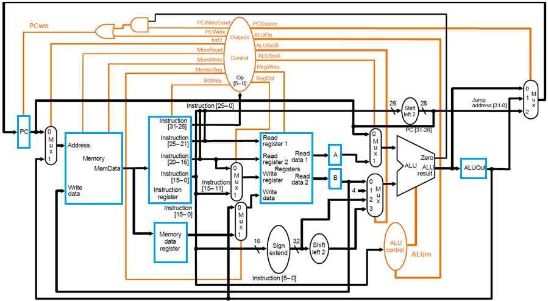
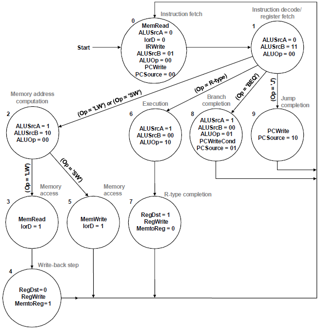

**《计算机组成原理实验》指导手册**

实验四 多周期CPU

## 1 实验目标

* 1.1  理解计算机硬件的基本组成、结构和工作原理；

* 1.2  掌握数字系统的设计和调试方法；

* 1.3  熟练掌握数据通路和控制器的设计和描述方法。

## 2 实验内容

### 2.1 多周期CPU

待设计的多周期CPU可以执行如下6条指令：

-   **add**: rd \<- rs + rt; op = 000000, funct = 100000

{width="5.09375in" height="0.3282250656167979in"}

-   **addi**: rt \<- rs + imm; op = 001000

> **lw**: rt \<- M(rs + addr); op = 100011
>
> **sw**: M(rs + addr) \<- rt; op = 101011
>
> **beq**: if (rs = rt) then pc \<- pc + 4 + addr \<\< 2
>
> else pc \<- pc + 4; op = 000100

{width="5.114583333333333in"
height="0.32169510061242346in"}

-   **j**: pc \<- (pc+4)\[31:28\] \| (add\<\<2)\[27:0\]; op = 000010

{width="5.114583333333333in"
height="0.3216940069991251in"}

待设计的CPU的逻辑符号如图-1所示，端口声明如下：

> module cpu\_one\_cycle //单周期CPU
>
> {width="1.1666666666666667in"
> height="0.5938910761154855in"}(input clk, //时钟（上升沿有效）
>
> input rst //异步复位，高电平有效
>
> );
>
> ......
>
> endmodule 图-1 CPU逻辑符号

满足上述指令的功能，设计多周期CPU的数据通路和控制器（橙色部分）如图-2所示，其中控制器的状态图如图-3所示。具体实现时ALU和寄存器堆可以利用实验1和实验2设计的模块，指令和数据存储共用一个RAM存储器，采用IP例化实现，容量为512
x 32位的分布式存储器。

{width="9.148303805774278in"
height="5.032271434820648in"}

图-2 多周期CPU的数据通路和控制器

{width="0.7221828521434821in"
height="3.431558398950131in"}

{width="4.5147233158355204in"
height="2.3333333333333335in"}

{width="5.625in" height="5.806399825021872in"}

图-3 多周期CPU控制器的状态图

### 2.2 调试单元（Debug Unit，DBU）

为了方便下载调试，设计一个调试单元DBU，该单元的功能和结构与实验三类似，可以用于控制CPU的运行方式，显示运行过程的中间状态和最终运行结果。DBU的端口与CPU以及FPGA开发板外设（拨动/按钮开关、LED指示灯、7-段数码管）的连接如图-4所示。为了DBU在不影响CPU运行的情况下，随时监视CPU运行过程中寄存器堆和数据存储器的内容，可以为寄存器堆和数据存储器增加1个用于调试的读端口。

{width="4.458333333333333in"
height="2.0883409886264217in"}

图-4 调试单元端口及其连接图

-   控制CPU运行方式

-   succ =
    1：clkd输出连续的周期性脉冲信号，可以作为CPU的时钟信号，控制CPU连续执行指令

-   succ =
    0：每按动step一次，clkd输出一个脉冲信号，可以作为CPU的时钟信号，控制CPU执行一个时钟周期

-   sel = 0：查看CPU运行结果 (存储器或者寄存器堆内容)

-   m\_rf： 1，查看存储器(MEM)；0，查看寄存器堆(RF)

-   m\_rf\_addr： MEM/RF的调试读口地址(字地址)，复位时为零

-   inc/dec：m\_rf\_addr加1或减1

-   rf\_data/m\_data：从RF/MEM读取的数据字

-   16个LED指示灯显示m\_rf\_addr

-   8个数码管显示rf\_data/m\_data

-   sel = 1 \~ 7：查看CPU运行状态（status）

-   16个LED指示灯(SW15\~SW0)依次显示控制器的控制信号PCSource(2)、PCwe、IorD、MemWrite、IRWrite、RegDst、MemtoReg、RegWrite、ALUm(3)、ALUSrcA、ALUSrcB(2)
    和ALUZero

-   8个数码管显示由sel选择的一个32位数据

> sel = 1：PC，程序计数器
>
> sel = 2：IR，指令寄存器
>
> sel = 3：MD, 存储器读出数据寄存器
>
> sel = 4：A, 寄存器堆读出寄存器A
>
> sel = 5：B, 寄存器堆读出寄存器B
>
> sel = 6：ALUOut, ALU运算结果寄存器
>
> sel = 7：

## 3 实验步骤

### 3.1  单周期CPU的设计和仿真

#### 3.1.1 CPU 的指令集层设计

对MIPS中 `opcode` 和 `funct` 分别进行定义如下：

##### 指令 `opcode`

rep[instr]

##### rtype指令 `funct`

rep[funct]

##### 控制单元 Signal 

控制单元 Signal 的定义如下：（与讲义定义相同，这里统一了变量书写形式（小写蛇形））

rep[sgn]

#### 3.1.2 CPU的设计

##### 数据通路设计

rep[cpu]

rep[stages]

rep[ctrl]

### 3.2  将CPU和DBU下载至FPGA中测试

## 5 思考题

> 1. 修改数据通路和控制器，扩展对其他MIPS指令的支持，并进行功能仿真和下载测试。
