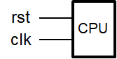

# 实验四 多周期CPU

* 本实验完整代码见 github：https://github.com/DnailZ/COLabs

[TOC]

## 1 实验目标

* 理解计算机硬件的基本组成、结构和工作原理；

* 掌握数字系统的设计和调试方法；

* 熟练掌握数据通路和控制器的设计和描述方法。

## 2 实验内容

### 2.1 多周期CPU

设计实现多周期CPU，具体要求参考讲义如下

> 待设计的多周期CPU可以执行如下6条指令：
> 
> -   **add**: `rd <- rs + rt; op = 000000, funct = 100000`
> 
> {width="5.09375in" height="0.3282250656167979in"}
> 
> -   **addi**: `rt <- rs + imm; op = 001000`
> 
> -  **lw**: `rt <- M(rs + addr); op = 100011`
> 
> -  **sw**: `M(rs + addr) <- rt; op = 101011`
> 
> -  **beq**: `if (rs = rt) then pc <- pc + 4 + addr << 2 else pc <- pc + 4; op = 000100`
> 
> {width="5.114583333333333in"
> height="0.32169510061242346in"}
> 
> -   **j**:  `pc <- (pc+4)[31:28] | (add<<2)[27:0]; op = 000010`
> 
> {width="5.114583333333333in"
> height="0.3216940069991251in"}

待设计的CPU的逻辑符号如图-1所示，端口声明如下：

{width="1.1666666666666667in"
height="0.5938910761154855in"}

```verilog
module cpu_one_cycle //单周期CPU
(
    input clk, //时钟（上升沿有效）
    input rst //异步复位，高电平有效
);
    ......
endmodule 
```

满足上述指令的功能，设计多周期CPU的数据通路和控制器（橙色部分）如图-2所示，其中控制器的状态图如图-3所示。具体实现时ALU和寄存器堆可以利用实验1和实验2设计的模块，指令和数据存储共用一个RAM存储器，采用IP例化实现，容量为512 x 32位的分布式存储器。

数据通路和状态机如下：

{width="9.148303805774278in"
height="5.032271434820648in"}

<center>图-2 多周期CPU的数据通路和控制器
</center>

{width="0.7221828521434821in"
height="3.431558398950131in"}

{width="4.5147233158355204in"
height="2.3333333333333335in"}

{width="5.625in" height="5.806399825021872in"}

<center>图-3 多周期CPU控制器的状态图
</center>

### 2.2 调试单元（Debug Unit，DBU）

调试单元的设计同单周期。

> 为了方便下载调试，设计一个调试单元DBU，该单元的功能和结构与实验三类似，可以用于控制CPU的运行方式，显示运行过程的中间状态和最终运行结果。DBU的端口与CPU以及FPGA开发板外设（拨动/按钮开关、> LED指示灯、7-段数码管）的连接如图-4所示。为了DBU在不影响CPU运行的情况下，随时监视CPU运行过程中寄存器堆和数据存储器的内容，可以为寄存器堆和数据存储器增加1个用于调试的读端口。
> 
> {width="4.458333333333333in"
> height="2.0883409886264217in"}
> 
> <center>图-4 调试单元端口及其连接图
> </center>
> 
> -   控制CPU运行方式
> 
> -   `succ = 1`：clkd输出连续的周期性脉冲信号，可以作为CPU的时钟信号，控制CPU连续执行指令
> 
> -   `succ = 0`：每按动step一次，clkd输出一个脉冲信号，可以作为CPU的时钟信号，控制CPU执行一个时钟周期
> 
> 
> -   `sel = 0`：查看CPU运行结果 (存储器或者寄存器堆内容)
> 
> 
> -   `m_rf` ： 1，查看存储器(MEM)；0，查看寄存器堆(RF)
> 
> -   `m_rf_addr` ： MEM/RF的调试读口地址(字地址)，复位时为零
> 
> -   `inc/dec` ：`m_rf_addr`加1或减1
> 
> -   `rf_data/m_data`：从RF/MEM读取的数据字
> 
> -   16个LED指示灯显示`m_rf_addr`
> 
> -   8个数码管显示`rf_data/m_data`
> 
> -   sel = 1 ~ 7：查看CPU运行状态（status）
> 
> -   16个LED指示灯(SW15\~SW0)依次显示控制器的控制信号PCSource(2)、PCwe、IorD、MemWrite、IRWrite、RegDst、MemtoReg、RegWrite、ALUm(3)、ALUSrcA、ALUSrcB(2)
>     和ALUZero
> 
> -   8个数码管显示由sel选择的一个32位数据
> 
>     ```verilog
>     sel = 1：PC，程序计数器
>     sel = 2：IR，指令寄存器
>     sel = 3：MD, 存储器读出数据寄存器
>     sel = 4：A, 寄存器堆读出寄存器A
>     sel = 5：B, 寄存器堆读出寄存器B
>     sel = 6：ALUOut, ALU运算结果寄存器
>     sel = 7：
>     ```

## 3 实验步骤

### 3.1  单周期CPU的设计和仿真

#### 3.1.1 CPU 的指令集层设计

对MIPS中 `opcode` 和 `funct` 分别进行定义如下：

##### 指令 `opcode`

所有支持的 opcode 列举如下。（就是MIPS在没有协处理器情况下，所支持的全部`opcode`）

rep[instr]

##### rtype指令 `funct`

所有支持的 `funct` 列举如下。（就是MIPS在没有协处理器情况下，所支持的全部`funct`）

rep[funct]

##### 控制单元 Signal 

控制单元 Signal 的定义如下：（与讲义定义名称相同，这里统一了变量书写形式（小写蛇形），当然也添加了很多）

rep[sgn]

##### ALU控制单元 Signal

rep[alusgn]

#### 3.1.2 CPU的设计

##### 数据通路设计

rep[cpu]

rep[stages]

rep[ctrl]

##### ALU 控制单元

由于这里的实现和单周期的一样，受限于篇幅，代码在此省略，可以参考：

https://github.com/DnailZ/COLabs/blob/master/lab4/src/verilog/logic/ALU_control.v

#### 3.1.3 对助教的代码进行仿真测试

编写仿真代码：

rep[cpu_sim]

得到仿真结果：代码大概在 PC=0x78 时变为 1，此时从CPU的状态可以看出正在执行 `sw` 指令。


从文本输出中可以看到 sw 将 $10 的数据写入内存中 8 处，测试成功。

#### 3.1.4 对DBU进行测试

DBU 不需要修改，仿真结果如下：


### 3.2  将CPU和DBU下载至FPGA中测试

## 4 实验总结

本次实验中我

* 加深了对计算机硬件的基本组成、结构和工作原理的理解；

* 练习了数字系统的设计和调试方法；

* 掌握了数据通路和控制器的设计和描述方法。

## 5 思考题

> 1. 修改数据通路和控制器，扩展对其他MIPS指令的支持，并进行功能仿真和下载测试。

### 5.1.1 较完整 MIPS 指令集 的 CPU 设计

之前的整个CPU的代码支持基本完整的 MIPS 指令集（不包括协处理器、陷入指令），可以具体设计可以参考前面的代码，这里摘录了一些相关内容。

##### 控制单元设计

增加大多数指令所需要的状态。


##### 位移指令的实现

在ALU增加对相关功能的支持

```verilog
    always @(*) begin
        {y, zf, cf, of} = 0;
        case(m)
            ......
            `ALU_SHL: y = b << a;
            `ALU_SHRL: y = b >> a;
            `ALU_SHRA: y = $unsigned($signed(b) >>> a);
            ......
            default: ;
        endcase
    end
```

在 ALUControl 单元中实现相关的 Funct：

```verilog
                `FUNCT_SLLV: begin            //
                    alu_m = `ALU_SHL;         // alu_m
                    alu_src1 = 1'b0;          // alu_src1 (by default)
                    alu_out_mux = 2'b00;      // alu_out_mux (by default)
                    is_jr_funct = 1'b0;       // is_jr_funct (by default)
                end                           //
                `FUNCT_SRLV: begin            //
                    alu_m = `ALU_SHRL;        // alu_m
                    alu_src1 = 1'b0;          // alu_src1 (by default)
                    alu_out_mux = 2'b00;      // alu_out_mux (by default)
                    is_jr_funct = 1'b0;       // is_jr_funct (by default)
                end                           //
                `FUNCT_SRAV: begin            //
                    alu_m = `ALU_SHRA;        // alu_m
                    alu_src1 = 1'b0;          // alu_src1 (by default)
                    alu_out_mux = 2'b00;      // alu_out_mux (by default)
                    is_jr_funct = 1'b0;       // is_jr_funct (by default)
                end                           //
                `FUNCT_SLL: begin                   //
                    alu_m = `ALU_SHL;               // alu_m
                    alu_src1 = `ALUSrc1_Shamt;      // alu_src1
                    alu_out_mux = 2'b00;            // alu_out_mux (by default)
                    is_jr_funct = 1'b0;             // is_jr_funct (by default)
                end                                 //
                `FUNCT_SRL: begin                   //
                    alu_m = `ALU_SHRL;              // alu_m
                    alu_src1 = `ALUSrc1_Shamt;      // alu_src1
                    alu_out_mux = 2'b00;            // alu_out_mux (by default)
                    is_jr_funct = 1'b0;             // is_jr_funct (by default)
                end                                 //
                `FUNCT_SRA: begin                   //
                    alu_m = `ALU_SHRA;              // alu_m
                    alu_src1 = `ALUSrc1_Shamt;      // alu_src1
                    alu_out_mux = 2'b00;            // alu_out_mux (by default)
                    is_jr_funct = 1'b0;             // is_jr_funct (by default)
                end                                 //
```

数据通路上增加一个选择器：

```verilog
	// 从ALU控制模块发送过来的，可以选择 `instruction[Shamt]` ，为位移操作指令提供支持。
    wire Word alu_a = aluctrl_alu_src1 == `ALUSrc1_Orig ? alu_a_orig : instruction [Shamt] ;
```

##### Jal 指令的实现

在 Jump 指令的基础上，增加保存 $ra 即可。

数据通路增加选择器：

```verilog
	assign regfile_wa = (sgn_reg_dst == `RegDst_Rt)? instruction [Rt] :
                        (sgn_reg_dst == `RegDst_Rd)? instruction [Rd] :
                        (sgn_reg_dst == `RegDst_RA)? 5'b11111 : 0; // jal 指令
    assign regfile_we = sgn_reg_write;
    assign regfile_wd = (sgn_mem_toreg == `MemToReg_Mem)? mdr :
                        (sgn_mem_toreg == `MemToReg_ALU)? alu_out :
                        (sgn_mem_toreg == `MemToReg_PC)? PC : 0; // jal 指令
```

控制单元增加状态：

```verilog
       STATE_JUMP_AND_LINK: begin
            sgn_pc_write = 1;
            sgn_pc_source = `PCSource_Jump;
            sgn_reg_write = 1;
            sgn_reg_dst = `RegDst_RA;
            sgn_mem_toreg = `MemToReg_PC;
            next = STATE_FI;
        end
```

##### 比较指令的实现

增加选择器。

```verilog
// ALUOut 选择器，为 `slt` 指令提供支持。
    always @(posedge clk) begin
        if(rst)
            alu_out <= 0;
        else if (run) begin
            case(aluctrl_alu_out_mux)
            `ALUOut_Orig: alu_out <= alu_y;  
            `ALUOut_LT: alu_out <= alu_y[WIDTH-1];
            `ALUOut_LTU: alu_out <= alu_cf; // 无符号数比较
            default: alu_out <= alu_y;
            endcase
        end
    end
```

增加状态：

```verilog
        STATE_SLTI: begin
            sgn_aluop = `ALUOp_CMD_SUB;
            sgn_alu_src2 = `ALUSrc2_SImm;
            sgn_alu_src1 = `ALUSrc1_OprA;
            sgn_alu_out_mux = `ALUOut_LT;
            next = STATE_IMM_WB;
        end
        STATE_SLTIU: begin
            sgn_aluop = `ALUOp_CMD_SUB;
            sgn_alu_src2 = `ALUSrc2_SImm;
            sgn_alu_src1 = `ALUSrc1_OprA;
            sgn_alu_out_mux = `ALUOut_LTU;
            next = STATE_IMM_WB;
        end
```

增加 funct

```verilog
                `FUNCT_SLT: begin                  //
                    alu_m = `ALU_SUB;              // alu_m
                    alu_src1 = 1'b0;               // alu_src1 (by default)
                    alu_out_mux = `ALUOut_LT;      // alu_out_mux
                    is_jr_funct = 1'b0;            // is_jr_funct (by default)
                end                                //
                `FUNCT_SLTU: begin                  //
                    alu_m = `ALU_SUB;               // alu_m
                    alu_src1 = 1'b0;                // alu_src1 (by default)
                    alu_out_mux = `ALUOut_LTU;      // alu_out_mux
                    is_jr_funct = 1'b0;             // is_jr_funct (by default)
                end               
```

##### jr 指令的实现

增肌funct：

```verilog
                `FUNCT_JR: begin              //
                    alu_m = `ALU_SUB;         // alu_m
                    alu_src1 = 1'b0;          // alu_src1 (by default)
                    alu_out_mux = 2'b00;      // alu_out_mux (by default)
                    is_jr_funct = 1'h1;       // is_jr_funct
                end                           //
```

更新PC：

```verilog
    always @(*) begin
        next_PC = 0;
        // PC_Srouce 选择器
        case(sgn_pc_source)
        `PCSource_NPC: next_PC = nPC;
        ......
        default: next_PC = 0;
        endcase
        // jr指令的特殊处理
        if(aluctrl_is_jr_funct)
            next_PC = operandA;
    end
    // jr 的优先级最高
    assign PCwe = aluctrl_is_jr_funct || sgn_pc_write || sgn_pc_write_cond && alu_zf || sgn_pc_write_notcond && ~alu_zf;

```

### 5.1.2 功能仿真

采用armips汇编，armips会检查延迟槽，故添加一些 `nop` 命令。测试成功时标志是 `$s2 == 1` 失败时会有 `$s1 == -1`。

```asm
.ps2
.create "output.bin",0

start:
        jal test_sll :: nop
        jal test_sra :: nop
        jal test_slt :: nop
        j success :: nop

test_sll:
        li $t0, 0x10000000
        sll $s0, $t0, 3
        beq $s0, $0, fail :: nop
        
        li $t2, 4
        sllv $s0, $t0, $t2
        bne $s0, $0, fail :: nop
        jr $ra

test_sra:
        li $t1, 0xFFFFFFF0
        li $t2, 3
        li $t3, -1
        srav $s0, $t1, $t2
        beq $s0, $t3, fail :: nop
        
        sra $s0, $t1, 4
        bne $s0, $t3, fail :: nop
        jr $ra

test_slt:
        li $t0, -4
        li $t1, -3
        bgt $t0, -1, fail :: nop
        blt $t0, -5, fail :: nop

        slt $s0, $t1, $t0
        bne $s0, $0, fail :: nop
        jr $ra :: nop
        
fail:  
        li $s2, -1
        j fail :: nop

success:
        li $s2, 1
        j success :: nop

.close
```

汇编成二进制，读入 dist_mem_gen 里面，仿真结果如下：


观察 $31 也就是 \$ra 可以帮助我们判断执行到哪一个函数，观察 \$18 可以发现上面的测试程序执行成功。


上面是执行 `li` 宏（伪指令）过程中的文本输出，可以看到汇编器将 `li` 转化成了 `ori` 指令执行。 

## 6 实验建议

1. 希望老师和助教能提供一个MIPS的汇编器脚本，方便大家在做思考题的时候编写测试程序并生成 Vivado 可读的 `coe` 文件。我基于 `armips` 的汇编器脚本可以作为参考，具体见 github ：https://github.com/DnailZ/COLabs