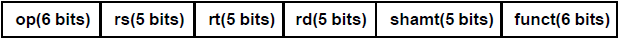
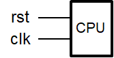
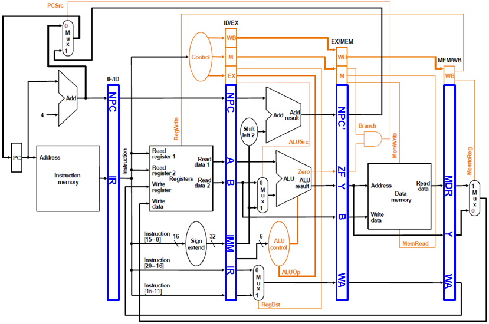
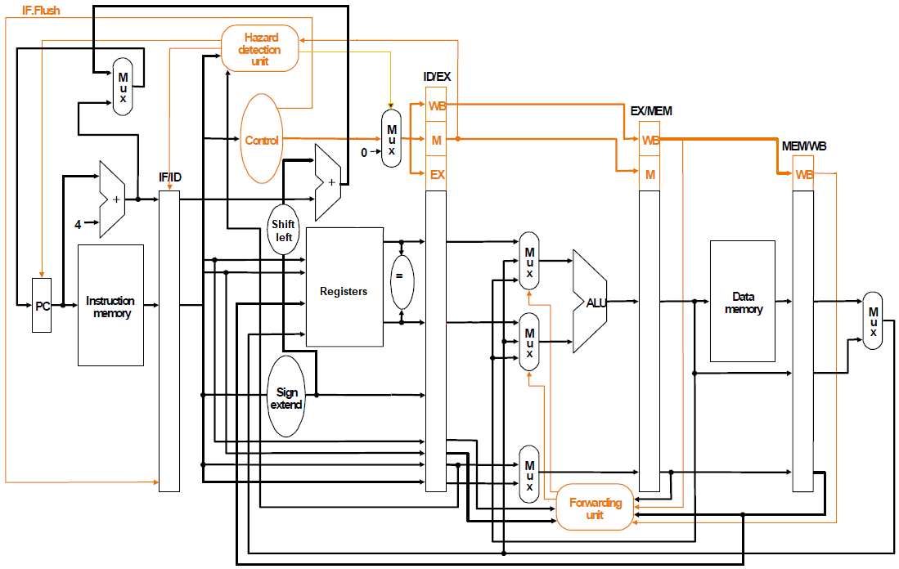
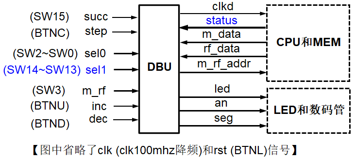

**《计算机组成原理实验》指导手册**

实验五 流水线CPU

## 1 实验目标

### 1.1  理解流水线CPU的组成结构和工作原理；

### 1.2  掌握数字系统的设计和调试方法；

### 1.3  熟练掌握数据通路和控制器的设计和描述方法。

## 2 实验内容

### 2.1 流水线CPU

待设计的流水线CPU可以执行如下6条指令：

-   **add**: rd \<- rs + rt; op = 000000, funct = 100000

{width="5.09375in" height="0.3282250656167979in"}

-   **addi**: rt \<- rs + imm; op = 001000

> **lw**: rt \<- M(rs + addr); op = 100011
>
> **sw**: M(rs + addr) \<- rt; op = 101011
>
> **beq**: if (rs = rt) then pc \<- pc + 4 + addr \<\< 2
>
> else pc \<- pc + 4; op = 000100

{width="5.114583333333333in"
height="0.32169510061242346in"}

-   **j**: pc \<- (pc+4)\[31:28\] \| (add\<\<2)\[27:0\]; op = 000010

{width="5.114583333333333in"
height="0.3216940069991251in"}

待设计的CPU的逻辑符号如图-1所示，端口声明如下：

> module cpu\_one\_cycle //单周期CPU
>
> {width="1.1666666666666667in"
> height="0.5938910761154855in"}(input clk, //时钟（上升沿有效）
>
> input rst //异步复位，高电平有效
>
> );
>
> ......
>
> endmodule 图-1 CPU逻辑符号

根据上述指令的功能，设计两种流水线CPU的不完全的数据通路如图-2和图-3所示，其中橙色部分为控制器。具体实现时ALU和寄存器堆可以利用实验1和实验2设计的模块，指令存储器ROM和数据存储器RAM均采用IP例化实现，容量为256
x 32位的分布式存储器。

{width="6.760416666666667in"
height="4.489583333333333in"}

图-2 无相关处理的流水线CPU的数据通路

{width="6.768055555555556in"
height="4.279166666666667in"}

图-3 有相关处理的流水线CPU的数据通路

### 2.2 调试单元（Debug Unit，DBU）

为了方便下载调试，设计一个调试单元DBU，该单元的功能和结构与实验四类似，可以用于控制CPU的运行方式，显示运行过程的中间状态和最终运行结果。DBU的端口与CPU以及FPGA开发板外设（拨动/按钮开关、LED指示灯、7-段数码管）的连接如图-4所示。为了DBU在不影响CPU运行的情况下，随时监视CPU运行过程中寄存器堆和数据存储器的内容，可以为寄存器堆和数据存储器增加1个用于调试的读端口。

{width="5.34375in" height="2.396042213473316in"}

图-4 调试单元端口及其连接图

-   控制CPU运行方式

-   succ =
    1：clkd输出连续的周期性脉冲信号，可以作为CPU的时钟信号，控制CPU连续执行指令

-   succ =
    0：每按动step一次，clkd输出一个脉冲信号，可以作为CPU的时钟信号，控制CPU执行一个时钟周期

-   sel0 = 0：查看CPU运行结果 (存储器或者寄存器堆内容)

-   m\_rf： 1，查看存储器(MEM)；0，查看寄存器堆(RF)

-   m\_rf\_addr： MEM/RF的调试读口地址(字地址)，复位时为零

-   inc/dec：m\_rf\_addr加1或减1

-   rf\_data/m\_data：从RF/MEM读取的数据字

-   16个LED指示灯显示m\_rf\_addr

-   8个数码管显示rf\_data/m\_data

-   sel0 = 1 \~ 7：查看CPU运行状态（status）

-   根据sel0
    
> （选择流水段）和sel1（选择相应段中寄存器），选择一个32位数据显示在8个数码管上
    
-   sel0 = 1：PC，程序计数器

-   sel0 = 2：IR/ID，sel1=0, NPC; sel1=1, IR

-   sel0 = 3：ID//EX, 。。。。

-   sel0 = 4：EX/MEM，。。。。

-   sel0 = 5：MEM/WB, 。。。。

-   sel0 = 6：

-   sel0 = 7：

-   根据需要在16个LED指示灯(SW15\~SW0) 上显示选中流水段的控制信号

## 3 实验步骤

### 3.1  设计实现图-2所示完整的无相关处理的流水线CPU，并进行功能仿真；

### 3.2  设计实现图-3所示完整的有相关处理的流水线CPU，包括无延迟分支的控制相关处理和数据相关处理（定向路径和流水线互锁），并进行功能仿真；

### 3.3  将上述一种流水线CPU下载至FPGA中测试。

## 4 实验总结

## 5 思考题

### 5.1  支持分支预测的流水线CPU的设计，并进行功能仿真和下载测试。

